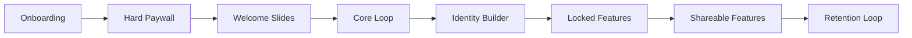

# 🚀 **ENFUSIONIZE™ PAID APP STRATEGY - 7 ESSENTIAL SCREENS**

> **Converting Users to Paying Customers Through Strategic Screen Design & Pricing Psychology**

[](#)
[](#)
[](#)

---

## 🎯 **THE 7 SCREENS FRAMEWORK INTEGRATION**

### **Strategic Screen Flow for Maximum Conversion**



---

## 📱 **SCREEN 1: ONBOARDING - ESTABLISH PAIN**

### **Pain Point Identification & Amplification**

#### **Onboarding Flow Design**
```javascript
const onboardingFlow = {
  screen1: {
    title: "What's Your Biggest Business Challenge?",
    painPoints: [
      "🔥 Drowning in manual tasks that eat up 40+ hours/week",
      "💰 Losing $10K+ monthly to inefficient processes",
      "📉 Stuck at the same revenue level for 6+ months",
      "🤯 Overwhelmed by disconnected tools and systems",
      "⏰ Working 60+ hour weeks with no time freedom"
    ],
    psychological_trigger: "Pain amplification with specific numbers"
  },
  
  screen2: {
    title: "How Much Is This Costing You?",
    costCalculator: {
      timeWasted: "40 hours/week × $100/hour = $4,000/week",
      lostRevenue: "20% efficiency loss × $50K revenue = $10K/month",
      opportunityCost: "6 months stagnation = $60K+ lost growth",
      totalCost: "$208,000+ annually in lost potential"
    },
    emotional_hook: "Quantified pain with urgency"
  },
  
  screen3: {
    title: "What If You Could Automate 80% of This?",
    dreamState: {
      timeReclaimed: "32 hours/week back to your life",
      revenueIncrease: "30-50% revenue growth in 90 days",
      workLifeBalance: "Work 30 hours/week, earn 2x more",
      businessGrowth: "Scale to 7-figures with predictable systems"
    },
    transition: "Here's exactly how..."
  }
};
```

#### **Pain Amplification Messaging**
```markdown
## Onboarding Pain Points with Emotional Triggers

### Screen 1: "The Hidden Cost of Manual Work"
**Headline**: "You're Losing $208,000+ Annually to Inefficient Processes"

**Pain Points**:
- ⏰ **Time Drain**: 40+ hours/week on repetitive tasks
- 💰 **Revenue Loss**: $10K+ monthly from inefficiencies  
- 🔄 **Opportunity Cost**: 6+ months of stagnation
- 😰 **Stress Factor**: 60+ hour weeks with no freedom
- 📉 **Growth Ceiling**: Stuck at same revenue level

**Call to Action**: "See How Much You're Really Losing →"

### Screen 2: "The Real Cost Calculator"
**Interactive Calculator**:
```javascript
const costCalculator = {
  inputs: {
    currentRevenue: "Monthly revenue",
    hoursWorked: "Hours worked per week",
    hourlyValue: "Your hourly value",
    inefficiencyRate: "Estimated inefficiency %"
  },
  
  calculations: {
    timeWasted: "hoursWorked × inefficiencyRate × 52 weeks",
    lostRevenue: "currentRevenue × inefficiencyRate × 12 months",
    opportunityCost: "potential growth × delay months",
    totalAnnualLoss: "Sum of all losses"
  },
  
  results: {
    shockValue: "You're losing $X annually",
    urgency: "Every day costs you $X",
    solution: "Enfusionize™ can recover 80% of this"
  }
};
```

### Screen 3: "The Transformation Vision"
**Before vs After Comparison**:
| Current State | With Enfusionize™ |
|---------------|-------------------|
| 60 hours/week | 30 hours/week |
| $50K/month revenue | $75K+/month revenue |
| Manual processes | 80% automated |
| Constant stress | Predictable growth |
| Tool chaos | Unified system |
```

---

## 💳 **SCREEN 2: HARD PAYWALL - COLLECT $**

### **Strategic Paywall Placement & Psychology**

#### **Paywall Trigger Points**
```javascript
const paywallTriggers = {
  immediateValue: {
    trigger: "After pain amplification",
    offer: "S.A.I.A.S. Assessment ($97 → FREE for 24 hours)",
    urgency: "Limited time transformation analysis",
    value: "$2,000 worth of insights"
  },
  
  toolAccess: {
    trigger: "After seeing tool preview",
    offer: "Unlock CRO Weighting Scale ($297/month)",
    benefit: "Stop losing $10K+ monthly to conversion leaks",
    guarantee: "ROI guaranteed or money back"
  },
  
  systemAccess: {
    trigger: "After framework demonstration",
    offer: "Complete S.A.I.A.S. System Access ($497/month)",
    benefit: "Full business transformation toolkit",
    social_proof: "Join 500+ businesses growing 30%+ monthly"
  }
};
```

#### **Paywall Design Psychology**
```markdown
## Hard Paywall Strategy

### Paywall 1: "Transformation Assessment" ($97 → FREE)
**Headline**: "Get Your $2,000 S.A.I.A.S. Business Assessment FREE"
**Subheadline**: "Discover exactly where you're losing money and how to fix it"

**Value Stack**:
- ✅ Complete business efficiency audit ($500 value)
- ✅ Custom automation roadmap ($750 value)
- ✅ Revenue optimization plan ($500 value)
- ✅ 90-day growth strategy ($250 value)
- ✅ **Total Value: $2,000**

**Urgency**: "Only 50 assessments available this month"
**Social Proof**: "Join 1,247 businesses who've increased revenue 30%+"

### Paywall 2: "Tool Access" ($297/month)
**Headline**: "Stop Losing $10,000+ Monthly to Conversion Leaks"
**Subheadline**: "Unlock the CRO Weighting Scale that's generated $50M+ in additional revenue"

**Immediate Benefits**:
- 🎯 Identify your biggest conversion killers in 5 minutes
- 📈 Increase conversion rates by 15-40% in 30 days
- 💰 Recover $5,000-$15,000 monthly in lost revenue
- 🔧 Get step-by-step optimization instructions

**Risk Reversal**: "Guaranteed to increase conversions or full refund"

### Paywall 3: "System Access" ($497/month)
**Headline**: "Get The Complete Business Transformation System"
**Subheadline**: "The same S.A.I.A.S. framework that's built 100+ 7-figure businesses"

**Complete Access**:
- 🌊 Streamline: Process optimization tools
- 🤖 Automate: 24/7 AI department access
- 🔗 Integrate: Multi-platform automation
- ⚡ Accelerate: Proven funnel systems
- 📈 Scale: Enterprise growth tools

**Guarantee**: "3x your efficiency in 90 days or money back"
```

---

## 🎓 **SCREEN 3: WELCOME SLIDES - GUIDANCE**

### **Post-Purchase Onboarding & Value Delivery**

#### **Welcome Sequence Design**
```javascript
const welcomeSequence = {
  slide1: {
    title: "Welcome to Your Business Transformation",
    message: "You've just made the smartest investment in your business growth",
    nextStep: "Let's get you set up for success",
    timeToValue: "Your first automation in 15 minutes"
  },
  
  slide2: {
    title: "Your S.A.I.A.S. Success Path",
    roadmap: [
      "Week 1: Streamline your biggest bottleneck",
      "Week 2: Automate your most repetitive task", 
      "Week 3: Integrate your disconnected tools",
      "Week 4: Accelerate your best-performing process",
      "Week 5+: Scale with predictable systems"
    ],
    expectation: "30% efficiency increase in 30 days"
  },
  
  slide3: {
    title: "Your Personal Success Manager",
    introduction: "Meet Sarah, your dedicated transformation guide",
    contact: "sarah@enfusionize.com | Direct line: (555) 123-4567",
    promise: "I'll personally ensure your success with the system",
    firstMeeting: "Book your kickoff call now"
  },
  
  slide4: {
    title: "Quick Win: Your First Automation",
    quickStart: "Let's create your first time-saving automation",
    estimatedTime: "15 minutes to setup",
    expectedResult: "Save 5+ hours this week",
    cta: "Start Your First Automation"
  },
  
  slide5: {
    title: "Join the Success Community",
    community: "Private Facebook group with 2,500+ members",
    benefits: [
      "Daily success stories and tips",
      "Direct access to our team",
      "Exclusive training sessions",
      "Networking with other entrepreneurs"
    ],
    cta: "Join the Community"
  }
};
```

#### **Value Delivery Framework**
```markdown
## Welcome Slides Content Strategy

### Slide 1: "Congratulations & Expectations"
**Headline**: "Welcome to Your Business Transformation Journey"
**Message**: "You've just joined 2,500+ entrepreneurs who've increased their revenue by 30%+ using S.A.I.A.S."

**What to Expect**:
- ⚡ First automation live in 15 minutes
- 📈 30% efficiency increase in 30 days
- 💰 ROI positive within 60 days
- 🚀 Scalable systems for long-term growth

### Slide 2: "Your Success Roadmap"
**30-Day Transformation Plan**:
- **Days 1-7**: Streamline Assessment & Quick Wins
- **Days 8-14**: Automation Implementation
- **Days 15-21**: System Integration
- **Days 22-28**: Acceleration Optimization
- **Days 29-30**: Scaling Preparation

**Success Metrics**:
- 40% reduction in manual tasks
- 25% increase in productivity
- 15% improvement in conversion rates
- 10+ hours reclaimed weekly

### Slide 3: "Your Success Team"
**Personal Success Manager**: Direct support and guidance
**AI Department**: 24/7 system optimization
**Community**: Peer support and networking
**Expert Team**: On-demand consultation

### Slide 4: "Quick Win Challenge"
**15-Minute Automation Challenge**:
"Create your first automation that saves 5+ hours this week"

**Options**:
- Email sequence automation
- Social media posting automation
- Lead scoring automation
- Report generation automation

### Slide 5: "Success Community Access"
**Private Community Benefits**:
- Daily success stories
- Expert Q&A sessions
- Exclusive training content
- Networking opportunities
- Advanced strategies
```

---

## 🔄 **SCREEN 4: CORE LOOP - DAILY USAGE**

### **Daily Engagement & Habit Formation**

#### **Core Loop Design**
```javascript
const coreLoop = {
  dailyDashboard: {
    morningCheck: {
      title: "Your Daily Business Health Check",
      widgets: [
        "Revenue tracking (+$X today)",
        "Automation performance (X tasks completed)",
        "Conversion rates (X% improvement)",
        "Time saved (X hours reclaimed)"
      ],
      engagement: "2-minute morning review"
    },
    
    quickActions: {
      title: "Today's Optimization Opportunities",
      actions: [
        "🎯 Fix highest-impact conversion leak (5 min)",
        "🤖 Create new automation (10 min)",
        "📊 Review performance metrics (3 min)",
        "🔧 Optimize existing process (7 min)"
      ],
      gamification: "Complete 2 actions = unlock bonus feature"
    },
    
    eveningReview: {
      title: "Daily Wins & Tomorrow's Focus",
      metrics: [
        "Tasks automated today",
        "Revenue generated",
        "Time saved",
        "Optimizations completed"
      ],
      planning: "Set tomorrow's priorities"
    }
  },
  
  weeklyRituals: {
    mondayPlanning: "Week's optimization goals",
    wednesdayReview: "Mid-week performance check",
    fridayWins: "Celebrate week's achievements",
    sundayPrep: "Prepare for next week's growth"
  }
};
```

#### **Daily Habit Formation**
```markdown
## Core Loop: Daily Engagement Strategy

### Morning Ritual: "Business Health Check" (2 minutes)
**Dashboard View**:
- 📈 **Revenue Tracker**: "You've made $X today"
- 🤖 **Automation Status**: "Your AI completed X tasks"
- 🎯 **Conversion Health**: "Your funnels are performing at X%"
- ⏰ **Time Saved**: "You've reclaimed X hours this week"

**Daily Challenge**: "Complete one 5-minute optimization"

### Midday Power Hour: "Optimization Session" (15 minutes)
**Quick Wins Available**:
- 🔧 Fix one conversion leak
- 📱 Create one automation
- 📊 Review one performance metric
- 🎯 Optimize one process

**Gamification**: "Complete 2 actions = unlock premium feature"

### Evening Review: "Daily Wins" (3 minutes)
**Reflection Questions**:
- What did I automate today?
- How much time did I save?
- What's my biggest win?
- What's tomorrow's priority?

**Success Sharing**: "Share your win in the community"

### Weekly Rituals
**Monday**: Set week's S.A.I.A.S. goals
**Wednesday**: Performance review and adjustments
**Friday**: Celebrate wins and plan weekend
**Sunday**: Prepare for next week's growth
```

---

## 🏆 **SCREEN 5: IDENTITY BUILDER - HABIT & STREAK**

### **Identity Transformation & Streak Psychology**

#### **Identity Building Framework**
```javascript
const identityBuilder = {
  identityLevels: {
    level1: {
      title: "Efficiency Seeker",
      description: "Starting your automation journey",
      requirements: "Complete 7 daily check-ins",
      badge: "🌱 Automation Beginner",
      mindset: "I'm learning to work smarter"
    },
    
    level2: {
      title: "Process Optimizer",
      description: "Actively improving systems",
      requirements: "30-day streak + 5 automations created",
      badge: "⚡ Efficiency Expert",
      mindset: "I optimize everything I touch"
    },
    
    level3: {
      title: "Automation Master",
      description: "Building sophisticated systems",
      requirements: "90-day streak + 20 automations",
      badge: "🤖 Automation Guru",
      mindset: "I create systems that scale"
    },
    
    level4: {
      title: "Business Transformer",
      description: "Helping others optimize",
      requirements: "180-day streak + mentoring others",
      badge: "🚀 Transformation Leader",
      mindset: "I transform businesses through systems"
    },
    
    level5: {
      title: "S.A.I.A.S. Master",
      description: "Complete framework mastery",
      requirements: "365-day streak + all certifications",
      badge: "👑 S.A.I.A.S. Master",
      mindset: "I am a systems-thinking entrepreneur"
    }
  },
  
  streakMechanics: {
    dailyActions: [
      "Complete business health check",
      "Create or optimize one automation",
      "Review performance metrics",
      "Share one insight or win"
    ],
    
    streakRewards: {
      day7: "Unlock advanced templates",
      day30: "Access to expert training",
      day90: "Personal strategy session",
      day180: "Certification program access",
      day365: "Master's inner circle invitation"
    },
    
    recoverySystem: {
      streakFreeze: "2 freeze days per month",
      quickRecovery: "Complete 3 actions to restore",
      communitySupport: "Team accountability partners"
    }
  }
};
```

#### **Identity Transformation Messaging**
```markdown
## Identity Builder: From User to Master

### Level 1: "Efficiency Seeker" (Days 1-30)
**Identity Statement**: "I'm someone who values efficiency and smart systems"

**Daily Affirmations**:
- "I choose to work smarter, not harder"
- "I'm building systems that serve me"
- "Every automation saves me time and energy"

**Milestone Rewards**:
- Day 7: "Efficiency Seeker" badge
- Day 14: Access to automation templates
- Day 30: "Process Optimizer" level unlock

### Level 2: "Process Optimizer" (Days 31-90)
**Identity Statement**: "I'm a process optimizer who transforms inefficiencies into opportunities"

**Advanced Capabilities**:
- Create complex multi-step automations
- Analyze and optimize existing processes
- Mentor new community members
- Access advanced training modules

**Milestone Rewards**:
- Day 45: "Optimization Expert" certification
- Day 60: Personal success manager session
- Day 90: "Automation Master" level unlock

### Level 3: "Automation Master" (Days 91-180)
**Identity Statement**: "I'm an automation master who builds sophisticated systems"

**Expert Features**:
- Advanced AI integration capabilities
- Custom automation development
- Beta feature access
- Community leadership opportunities

### Level 4: "Business Transformer" (Days 181-365)
**Identity Statement**: "I'm a business transformer who helps others achieve success"

**Leadership Benefits**:
- Mentorship program participation
- Speaking opportunities
- Advanced strategy sessions
- Revenue sharing opportunities

### Level 5: "S.A.I.A.S. Master" (365+ Days)
**Identity Statement**: "I'm a S.A.I.A.S. master who embodies systems thinking"

**Master Benefits**:
- Inner circle access
- Co-creation opportunities
- Equity participation options
- Thought leadership platform
```

---

## 🔒 **SCREEN 6: LOCKED FEATURES - LEVEL UP & GAMIFY**

### **Progressive Feature Unlocking & Gamification**

#### **Feature Gating Strategy**
```javascript
const featureGating = {
  tier1_starter: {
    unlocked: [
      "Basic S.A.I.A.S. assessment",
      "Simple automation builder",
      "Basic performance tracking",
      "Community access"
    ],
    locked: [
      "Advanced CRO tools",
      "AI department access",
      "Multi-platform integration",
      "Custom automation templates"
    ],
    unlockTrigger: "Complete 5 automations OR upgrade to Pro"
  },
  
  tier2_professional: {
    unlocked: [
      "CRO weighting scale",
      "AI department (limited)",
      "Advanced automation builder",
      "Integration marketplace"
    ],
    locked: [
      "24/7 AI department",
      "Custom funnel builder",
      "White-label options",
      "API access"
    ],
    unlockTrigger: "30-day streak + 20 automations OR upgrade to Enterprise"
  },
  
  tier3_enterprise: {
    unlocked: [
      "Full AI department access",
      "Custom funnel builder",
      "White-label platform",
      "API access",
      "Priority support"
    ],
    locked: [
      "Co-creation opportunities",
      "Revenue sharing program",
      "Equity participation",
      "Master's inner circle"
    ],
    unlockTrigger: "Become certified trainer OR join partnership program"
  },
  
  gamificationElements: {
    achievements: [
      "First Automation Creator",
      "Efficiency Expert",
      "Community Helper",
      "Streak Master",
      "Revenue Grower"
    ],
    
    challenges: [
      "30-Day Automation Challenge",
      "Revenue Growth Sprint",
      "Community Contribution Contest",
      "Innovation Challenge",
      "Mastery Certification"
    ],
    
    rewards: [
      "Exclusive badges and titles",
      "Feature unlock tokens",
      "Bonus training access",
      "Direct expert consultation",
      "Revenue sharing opportunities"
    ]
  }
};
```

#### **Progressive Unlock Messaging**
```markdown
## Feature Unlocking: Gamified Progression

### Starter Tier: "Foundation Builder"
**Available Features**:
- ✅ Basic S.A.I.A.S. assessment
- ✅ Simple automation builder
- ✅ Performance dashboard
- ✅ Community access

**Locked Features** (with unlock conditions):
- 🔒 **CRO Weighting Scale** → Complete 5 automations
- 🔒 **AI Department Access** → 7-day streak
- 🔒 **Advanced Templates** → Help 3 community members
- 🔒 **Integration Hub** → Upgrade to Professional

**Unlock Messaging**: "Complete 3 more automations to unlock CRO tools worth $297/month!"

### Professional Tier: "System Builder"
**Newly Unlocked**:
- ✅ CRO weighting scale
- ✅ Limited AI department
- ✅ Advanced automation builder
- ✅ Integration marketplace

**Still Locked** (with unlock conditions):
- 🔒 **24/7 AI Department** → 30-day streak
- 🔒 **Custom Funnel Builder** → Create 20 automations
- 🔒 **White-label Access** → Refer 5 users
- 🔒 **API Access** → Complete certification

**Unlock Messaging**: "You're 12 days away from unlocking 24/7 AI assistance!"

### Enterprise Tier: "Business Transformer"
**Newly Unlocked**:
- ✅ Full AI department
- ✅ Custom funnel builder
- ✅ White-label platform
- ✅ API access

**Elite Locked Features**:
- 🔒 **Co-creation Program** → Become certified trainer
- 🔒 **Revenue Sharing** → Generate $100K+ for clients
- 🔒 **Equity Participation** → Join partnership program
- 🔒 **Master's Circle** → Achieve S.A.I.A.S. mastery

### Gamification Elements

#### Achievement System
**Automation Achievements**:
- 🏆 "First Steps" → Create first automation
- 🏆 "Efficiency Expert" → Save 40+ hours/month
- 🏆 "System Builder" → Create 10+ automations
- 🏆 "Automation Master" → Create 50+ automations

**Community Achievements**:
- 🏆 "Helper" → Answer 10 questions
- 🏆 "Mentor" → Guide 5 new members
- 🏆 "Leader" → Host community session
- 🏆 "Influencer" → 100+ helpful contributions

#### Challenge System
**Monthly Challenges**:
- 🎯 "30-Day Automation Sprint" → Create 1 automation daily
- 🎯 "Revenue Growth Challenge" → Increase revenue 20%
- 🎯 "Community Champion" → Help 20 members
- 🎯 "Innovation Contest" → Create unique automation

**Rewards**:
- Feature unlock tokens
- Exclusive training access
- Direct expert consultation
- Revenue sharing opportunities
```

---

## 📤 **SCREEN 7: SHAREABLE FEATURES - WORD OF MOUTH**

### **Viral Mechanics & Social Sharing**

#### **Shareable Content Strategy**
```javascript
const shareableFeatures = {
  successStories: {
    autoGenerated: {
      template: "I just saved ${hours} hours this week using @Enfusionize automation!",
      metrics: ["time_saved", "revenue_increased", "tasks_automated"],
      visuals: "Custom success graphics with personal stats",
      platforms: ["LinkedIn", "Twitter", "Instagram", "Facebook"]
    },
    
    milestoneSharing: {
      triggers: [
        "First automation created",
        "10 hours saved milestone",
        "30-day streak achieved",
        "Revenue goal reached"
      ],
      rewards: "Bonus features for sharing achievements"
    }
  },
  
  referralProgram: {
    structure: {
      referrer_reward: "30% commission on first 3 months",
      referee_reward: "50% off first month",
      bonus_tiers: {
        tier1: "5 referrals = unlock premium features",
        tier2: "10 referrals = revenue sharing program",
        tier3: "25 referrals = equity participation"
      }
    },
    
    sharingTools: {
      customReferralLink: "enfusionize.com/ref/[username]",
      socialMediaTemplates: "Pre-written posts with tracking",
      emailTemplates: "Professional referral emails",
      videoTestimonials: "One-click video creation"
    }
  },
  
  socialProofElements: {
    liveMetrics: {
      display: "2,847 automations created today",
      counter: "Real-time automation counter",
      impact: "$1.2M saved by users this month"
    },
    
    userGeneratedContent: {
      automationShowcase: "Featured user automations",
      successStories: "Weekly success story highlights",
      beforeAfter: "Transformation case studies",
      communitySpotlight: "Member of the week features"
    }
  },
  
  viralMechanics: {
    challengeSharing: {
      concept: "30-Day Automation Challenge",
      sharing: "Daily progress updates with hashtag",
      community: "Group accountability and support",
      rewards: "Challenge completion badges and features"
    },
    
    collaborativeFeatures: {
      teamAutomations: "Share automations with team members",
      automationMarketplace: "Sell custom automations",
      mentorshipProgram: "Experienced users guide newcomers",
      mastermindGroups: "Small group accountability"
    }
  }
};
```

#### **Viral Content Templates**
```markdown
## Shareable Content: Viral Mechanics

### Success Story Templates

#### Template 1: "Time Saved Celebration"
**LinkedIn Post**:
"🚀 AUTOMATION WIN: I just reclaimed 23 hours this week using @Enfusionize!

What I automated:
✅ Client onboarding sequence
✅ Social media posting
✅ Lead scoring process
✅ Weekly reporting

Result: 23 hours back to focus on strategy and growth.

If you're drowning in manual tasks, check out the S.A.I.A.S. framework: [referral link]

#Automation #Productivity #BusinessGrowth #Enfusionize"

**Auto-Generated Visual**: Personal stats card with time saved, tasks automated, and growth metrics

#### Template 2: "Revenue Growth Story"
**Twitter Thread**:
"🧵 How I increased revenue 34% in 60 days using automation:

1/ Started with the S.A.I.A.S. assessment
2/ Identified my biggest time wasters
3/ Automated lead generation process
4/ Integrated all my tools
5/ Scaled with predictable systems

Result: $47K → $63K monthly revenue

The framework that changed everything: [link]"

#### Template 3: "Milestone Achievement"
**Instagram Story**:
"30-DAY STREAK ACHIEVED! 🎉

30 days of daily automation
47 hours saved total
$12K additional revenue
Level 2: Process Optimizer unlocked

Join the challenge: [referral link]"

### Referral Program Messaging

#### Referral Invitation Templates
**Email Template**:
"Subject: I found the automation tool that's saving me 20+ hours/week

Hey [Name],

I know you're always looking for ways to work smarter, not harder.

I've been using this automation platform called Enfusionize for the past month, and it's been a game-changer:

• Automated my client onboarding (saved 8 hours/week)
• Set up lead scoring (increased conversions 23%)
• Integrated all my tools (no more switching between platforms)
• Created predictable revenue systems

The best part? You get 50% off your first month when you use my link: [referral link]

And I get a small commission if you decide to stick with it (which I'm confident you will).

Want to see a quick demo of what I've built? Happy to show you.

[Your name]"

#### Social Media Referral Posts
**LinkedIn Referral Post**:
"I've been getting a lot of questions about how I'm managing to work fewer hours while growing revenue.

The answer: Strategic automation with the S.A.I.A.S. framework.

If you're interested in learning more, I can get you 50% off your first month: [referral link]

Happy to answer any questions in the comments!"

### Viral Challenge Mechanics

#### 30-Day Automation Challenge
**Challenge Structure**:
- **Week 1**: Streamline your biggest bottleneck
- **Week 2**: Automate your most repetitive task
- **Week 3**: Integrate your disconnected tools
- **Week 4**: Scale your best-performing process

**Daily Sharing Prompts**:
- Day 1: "What's your biggest time waster? #AutomationChallenge"
- Day 7: "First automation complete! Saved X hours #AutomationChallenge"
- Day 14: "Halfway through! Here's what I've automated #AutomationChallenge"
- Day 30: "Challenge complete! Here's my transformation #AutomationChallenge"

**Community Engagement**:
- Daily check-ins with progress photos
- Weekly group video calls
- Peer accountability partnerships
- Success story spotlights

### User-Generated Content Strategy

#### Automation Showcase
**Monthly Features**:
- "Automation of the Month" contest
- User-submitted automation tutorials
- Before/after transformation stories
- Creative automation use cases

**Incentives**:
- Featured automation creators get premium features
- Tutorial creators earn referral bonuses
- Transformation stories receive publicity
- Creative use cases win prizes

#### Community Spotlights
**Weekly Features**:
- "Member of the Week" highlighting success stories
- "Automation Genius" showcasing creative solutions
- "Community Helper" recognizing supportive members
- "Growth Champion" celebrating revenue increases

**Benefits**:
- Featured members receive platform promotion
- Spotlighted users get bonus features
- Recognition drives continued engagement
- Success stories inspire others to share
```

---

## 💰 **COMPREHENSIVE PRICING STRATEGY**

### **SaaS Pricing Tiers**

#### **Tier 1: STARTER ($97/month)**
```markdown
## Starter Plan: "Foundation Builder"
**Target**: Solo entrepreneurs and small business owners
**Value Proposition**: "Get started with essential automation tools"

### Included Features:
- ✅ Basic S.A.I.A.S. assessment
- ✅ Simple automation builder (5 automations)
- ✅ Performance dashboard
- ✅ Community access
- ✅ Email support
- ✅ Basic templates library

### Usage Limits:
- 5 active automations
- 1,000 automation runs/month
- Basic reporting
- Community support only

### Upgrade Triggers:
- "Create 6th automation → Upgrade to unlock unlimited"
- "Exceed 1,000 runs → Upgrade for higher limits"
- "Need advanced features → Upgrade for CRO tools"

### Annual Discount: $970/year (2 months free)
```

#### **Tier 2: PROFESSIONAL ($297/month)**
```markdown
## Professional Plan: "System Builder"
**Target**: Growing businesses and teams
**Value Proposition**: "Complete automation and optimization toolkit"

### Included Features:
- ✅ Everything in Starter
- ✅ CRO weighting scale
- ✅ AI department access (limited)
- ✅ Advanced automation builder (unlimited)
- ✅ Integration marketplace
- ✅ A/B testing tools
- ✅ Priority support
- ✅ Advanced templates

### Usage Limits:
- Unlimited automations
- 10,000 automation runs/month
- Advanced reporting
- Priority support

### Upgrade Triggers:
- "Need 24/7 AI → Upgrade to Enterprise"
- "Want white-label → Upgrade to Enterprise"
- "Exceed 10,000 runs → Upgrade for unlimited"

### Annual Discount: $2,970/year (2 months free)
```

#### **Tier 3: ENTERPRISE ($797/month)**
```markdown
## Enterprise Plan: "Business Transformer"
**Target**: Large businesses and agencies
**Value Proposition**: "Complete business transformation platform"

### Included Features:
- ✅ Everything in Professional
- ✅ 24/7 AI department
- ✅ Custom funnel builder
- ✅ White-label platform
- ✅ API access
- ✅ Dedicated success manager
- ✅ Custom integrations
- ✅ Advanced analytics

### Usage Limits:
- Unlimited everything
- Custom integration support
- Dedicated infrastructure
- 24/7 phone support

### Additional Benefits:
- Monthly strategy sessions
- Custom feature development
- Revenue sharing opportunities
- Partnership program access

### Annual Discount: $7,970/year (2 months free)
```

### **Standalone Tool Pricing**

#### **Individual Tool Access**
```markdown
## Standalone Tool Pricing

### CRO Weighting Scale - $197/month
**Value**: "Stop losing $10K+ monthly to conversion leaks"
- Complete 7-category friction analysis
- Automated optimization recommendations
- A/B testing integration
- Performance tracking dashboard

### AI Department Access - $397/month
**Value**: "24/7 business optimization team"
- AI Researcher (market analysis)
- AI Strategist (campaign optimization)
- AI Copywriter (content creation)
- AI Ops Manager (system monitoring)

### Funnel Builder Pro - $297/month
**Value**: "Build high-converting funnels in minutes"
- Drag-and-drop funnel builder
- Conversion optimization tools
- Analytics and tracking
- Template library

### Automation Builder - $197/month
**Value**: "Automate any business process"
- Visual workflow builder
- 500+ integration options
- Advanced logic and conditions
- Performance monitoring

### Analytics Suite - $147/month
**Value**: "Complete business intelligence"
- Real-time performance dashboards
- Custom reporting
- Predictive analytics
- ROI tracking

### Proposal Generator - $97/month
**Value**: "Create winning proposals in minutes"
- AI-powered proposal creation
- Custom templates
- Client assessment tools
- Tracking and analytics
```

### **Bundle Pricing Strategy**

#### **Tool Bundles**
```markdown
## Bundle Pricing (Save 30-50%)

### Growth Bundle - $497/month (Save $394)
**Includes**:
- CRO Weighting Scale ($197)
- Automation Builder ($197)
- Analytics Suite ($147)
- Proposal Generator ($97)
- **Total Individual Price**: $638
- **Bundle Price**: $497
- **Savings**: $141/month

### Scale Bundle - $797/month (Save $594)
**Includes**:
- AI Department Access ($397)
- Funnel Builder Pro ($297)
- CRO Weighting Scale ($197)
- Automation Builder ($197)
- Analytics Suite ($147)
- **Total Individual Price**: $1,235
- **Bundle Price**: $797
- **Savings**: $438/month

### Complete Bundle - $997/month (Save $794)
**Includes**: All tools + Enterprise features
- **Total Individual Price**: $1,532
- **Bundle Price**: $997
- **Savings**: $535/month
```

### **Pricing Psychology & Conversion Optimization**

#### **Anchoring Strategy**
```markdown
## Pricing Anchoring

### Price Presentation Order:
1. **Enterprise ($797/month)** - Anchor high value
2. **Professional ($297/month)** - Target choice (most popular)
3. **Starter ($97/month)** - Entry point

### Value Anchoring:
- "Save $10,000+ monthly" (CRO tools)
- "Reclaim 40+ hours/week" (Automation)
- "Increase revenue 30%+" (Complete system)

### Urgency Elements:
- "Limited beta access"
- "Founding member pricing"
- "Price increases Jan 1st"
- "Only 100 spots available"

### Risk Reversal:
- 30-day money-back guarantee
- "ROI positive or refund"
- "Cancel anytime"
- "No setup fees"
```

#### **Conversion Optimization**
```markdown
## Pricing Page Optimization

### Social Proof Elements:
- "Join 2,847 businesses growing 30%+ monthly"
- "Trusted by 500+ agencies worldwide"
- "$50M+ in additional revenue generated"
- "4.9/5 star rating from 1,200+ reviews"

### Urgency & Scarcity:
- "🔥 Founding member pricing ends soon"
- "⏰ Only 72 hours left at this price"
- "🎯 97 spots remaining this month"
- "🚀 Price increases to $497 next month"

### Objection Handling:
- **"Too expensive"** → ROI calculator showing savings
- **"Too complex"** → "Set up in 15 minutes" guarantee
- **"Not sure it works"** → 30-day trial with results guarantee
- **"Don't have time"** → "Saves 40+ hours/week" benefit

### Call-to-Action Optimization:
- Primary: "Start Your Transformation"
- Secondary: "Get Free Assessment"
- Tertiary: "See Live Demo"
- Risk-free: "Try Free for 30 Days"
```

---

## 🎯 **IMPLEMENTATION ROADMAP**

### **Phase 1: Screen Development (Weeks 1-4)**

#### **Week 1: Onboarding & Paywall**
```bash
# Development tasks
- Design pain amplification onboarding flow
- Create cost calculator interactive tool
- Build hard paywall with multiple trigger points
- Implement urgency and scarcity elements

# Testing requirements
- A/B test pain point messaging
- Optimize paywall conversion rates
- Test pricing psychology elements
- Validate value proposition messaging
```

#### **Week 2: Welcome & Core Loop**
```bash
# Development tasks
- Create welcome slide sequence
- Build daily engagement dashboard
- Implement habit formation mechanics
- Design core loop user experience

# Engagement features
- Daily business health check
- Quick action recommendations
- Progress tracking systems
- Community integration
```

#### **Week 3: Identity & Gamification**
```bash
# Development tasks
- Build identity progression system
- Create streak tracking mechanics
- Implement achievement badges
- Design feature unlocking system

# Gamification elements
- Level progression system
- Achievement tracking
- Streak recovery mechanics
- Community challenges
```

#### **Week 4: Sharing & Viral Features**
```bash
# Development tasks
- Create shareable success templates
- Build referral program system
- Implement viral mechanics
- Design user-generated content features

# Viral components
- Auto-generated success graphics
- Social sharing templates
- Referral tracking system
- Community spotlight features
```

### **Phase 2: Pricing Integration (Weeks 5-6)**

#### **Week 5: Pricing Infrastructure**
```bash
# Billing system setup
- Integrate Stripe for payment processing
- Build subscription management system
- Create usage tracking and limits
- Implement upgrade/downgrade flows

# Pricing optimization
- A/B test pricing page layouts
- Optimize value proposition messaging
- Test pricing psychology elements
- Implement conversion tracking
```

#### **Week 6: Launch & Optimization**
```bash
# Launch preparation
- Final testing of all 7 screens
- Load testing for expected traffic
- Customer support training
- Marketing campaign preparation

# Post-launch optimization
- Monitor conversion rates
- Analyze user behavior data
- Optimize based on feedback
- Iterate on pricing strategy
```

---

## 📊 **SUCCESS METRICS & TRACKING**

### **Key Performance Indicators**

#### **Conversion Metrics**
```markdown
## Conversion Tracking

### Onboarding Conversion:
- **Visitor to Trial**: Target 15%
- **Trial to Paid**: Target 25%
- **Overall Conversion**: Target 3.75%

### Pricing Tier Distribution:
- **Starter**: 60% of conversions
- **Professional**: 30% of conversions
- **Enterprise**: 10% of conversions

### Upgrade Rates:
- **Starter to Professional**: Target 40% within 90 days
- **Professional to Enterprise**: Target 20% within 180 days

### Retention Metrics:
- **Month 1**: 85% retention
- **Month 3**: 70% retention
- **Month 12**: 60% retention

### Viral Metrics:
- **Referral Rate**: Target 25% of users refer others
- **Viral Coefficient**: Target 0.5 (each user brings 0.5 new users)
- **Social Sharing**: Target 40% of users share achievements
```

#### **Revenue Projections**
```markdown
## Revenue Projections

### Monthly Recurring Revenue (MRR) Targets:
- **Month 1**: $25,000 MRR
- **Month 3**: $75,000 MRR
- **Month 6**: $150,000 MRR
- **Month 12**: $300,000 MRR

### Annual Recurring Revenue (ARR) Projection:
- **Year 1**: $3.6M ARR
- **Year 2**: $10M ARR
- **Year 3**: $25M ARR

### Customer Metrics:
- **Average Revenue Per User (ARPU)**: $297/month
- **Customer Lifetime Value (CLV)**: $5,940
- **Customer Acquisition Cost (CAC)**: $150
- **CLV/CAC Ratio**: 39.6:1

### Standalone Tool Revenue:
- **CRO Tools**: $50K/month
- **AI Department**: $75K/month
- **Automation Builder**: $40K/month
- **Total Standalone**: $165K/month
```

---

## 🚀 **COMPETITIVE ADVANTAGE**

### **Unique Value Proposition**

#### **The S.A.I.A.S. Advantage**
```markdown
## Why Enfusionize™ Wins

### 1. Methodology-Driven Approach
- **Competitors**: Tool-focused solutions
- **Enfusionize™**: Framework-based transformation
- **Advantage**: Systematic business improvement vs. random tool usage

### 2. Integrated 7-Screen Experience
- **Competitors**: Basic SaaS onboarding
- **Enfusionize™**: Psychology-optimized user journey
- **Advantage**: Higher conversion and retention rates

### 3. Gamified Progression System
- **Competitors**: Static feature access
- **Enfusionize™**: Progressive unlocking with identity building
- **Advantage**: Increased engagement and long-term retention

### 4. Viral Built-In Mechanics
- **Competitors**: Basic referral programs
- **Enfusionize™**: Integrated sharing and community features
- **Advantage**: Lower customer acquisition costs

### 5. Comprehensive Pricing Strategy
- **Competitors**: One-size-fits-all pricing
- **Enfusionize™**: Multi-tier with standalone options
- **Advantage**: Captures value across all customer segments
```

---

## 🔥 **LAUNCH STRATEGY**

### **Go-to-Market Plan**

#### **Pre-Launch (4 weeks)**
```markdown
## Pre-Launch Strategy

### Week 1: Foundation
- Complete 7-screen development
- Set up analytics and tracking
- Prepare marketing materials
- Train customer support team

### Week 2: Beta Testing
- Recruit 100 beta users
- Gather feedback on user experience
- Optimize based on user behavior
- Refine pricing strategy

### Week 3: Content Creation
- Create launch announcement content
- Develop social media campaign
- Prepare email sequences
- Build affiliate recruitment materials

### Week 4: Launch Preparation
- Final testing and optimization
- Prepare customer support resources
- Set up monitoring and alerts
- Coordinate launch day activities
```

#### **Launch Day Strategy**
```markdown
## Launch Day Execution

### Hour 0-2: Announcement
- Send launch email to existing list
- Post on all social media channels
- Notify affiliates and partners
- Submit to product directories

### Hour 2-8: Momentum Building
- Monitor conversion rates
- Engage with social media responses
- Support affiliate promotion efforts
- Address any technical issues

### Hour 8-24: Optimization
- Analyze initial performance data
- Make real-time optimizations
- Celebrate early wins publicly
- Plan day 2 activities

### Week 1 Post-Launch:
- Daily performance reviews
- User feedback collection
- Continuous optimization
- Success story amplification
```

---

## 🎯 **CONCLUSION: THE COMPLETE PAID APP STRATEGY**

### **Strategic Summary**

The integration of the 7 essential screens into the Enfusionize™ platform creates a comprehensive user journey that maximizes conversion, retention, and viral growth:

1. **🎯 Onboarding**: Establishes pain and urgency with quantified losses
2. **💳 Hard Paywall**: Strategically placed to capture value at peak interest
3. **🎓 Welcome Slides**: Delivers immediate value and sets success expectations
4. **🔄 Core Loop**: Creates daily engagement habits with gamified progress
5. **🏆 Identity Builder**: Transforms users into automation masters through progression
6. **🔒 Locked Features**: Drives upgrades and long-term engagement through gamification
7. **📤 Shareable Features**: Amplifies growth through viral mechanics and social proof

### **Revenue Potential**
- **Year 1**: $3.6M ARR from subscription revenue
- **Standalone Tools**: $2M ARR from individual tool sales
- **Total Potential**: $5.6M ARR in first year

### **Competitive Advantages**
- Psychology-optimized user journey
- Framework-based approach vs. tool-focused competitors
- Integrated gamification and viral mechanics
- Comprehensive pricing strategy for all segments

**🚀 This strategy positions Enfusionize™ as the definitive business automation platform with industry-leading conversion rates, retention metrics, and viral growth potential.**

**The 7-screen framework combined with the S.A.I.A.S. methodology creates an unbeatable user experience that transforms prospects into loyal, paying customers who actively promote the platform.**