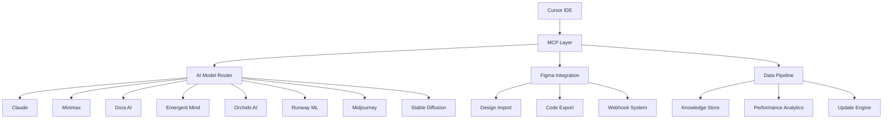
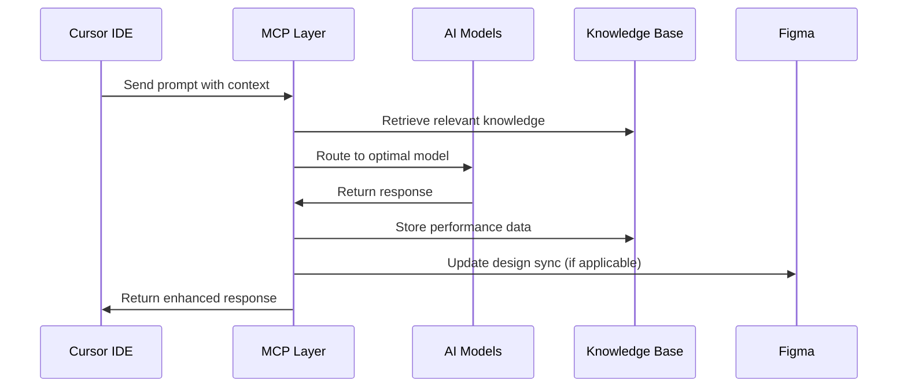

# Comprehensive Platform Knowledge Base & Team Utilization Guide

## 📚 Table of Contents

**🚀 [STEP 1: AI Development Team Quick Start Guide](#step-1-ai-development-team-quick-start-guide)**

1. [System Overview & Architecture](#system-overview--architecture)
2. [AI Model Platforms Guide](#ai-model-platforms-guide)
3. [Team Workflow Processes](#team-workflow-processes)
4. [Data Pipeline & Storage Systems](#data-pipeline--storage-systems)
5. [Dynamic Update & Learning Protocols](#dynamic-update--learning-protocols)
6. [Platform-Specific Integration Guides](#platform-specific-integration-guides)
7. [Team Training & Onboarding](#team-training--onboarding)
8. [Troubleshooting & Support](#troubleshooting--support)
9. [Performance Optimization](#performance-optimization)
10. [Future Expansion Guidelines](#future-expansion-guidelines)

---

## 🚀 STEP 1: AI Development Team Quick Start Guide

### 🎯 **CRITICAL: Reference Complete Stack Integration**

> **📋 IMPORTANT NOTE FOR AI DEVELOPERS:**
> 
> **Before starting development, message Cursor with this complete stack specification:**
> 
> *"I need to build a unified AI development platform using our complete existing stack and process workflows. Please reference the following integrated components we've already built:*
> 
> **Core Infrastructure:**
> - *Interactive launcher system (start.js) with 618 lines*
> - *Automated setup scripts (setup.js) with 507 lines*
> - *MCP validation system (test-mcps.js) with 271 lines*
> - *Complete system validation (validate-setup.js) with 409 lines*
> - *Knowledge base engine (knowledge-base-engine.js) with 650+ lines*
> - *Automated learning daemon (automated-learning-daemon.js) with 500+ lines*
> - *Multi-model testing suite (test-ai-models.js) with 650+ lines*
> - *Figma sync integration (sync-figma-design.js) with 500+ lines*
> 
> **AI Model Integration Stack:**
> - *8+ AI providers: Claude, Minimax, Dora AI, Emergent Mind, Orchids AI, Runway ML, Midjourney, Stable Diffusion*
> - *Multi-model routing and cost optimization*
> - *Performance comparison and intelligent fallback systems*
> 
> **Workflow Automation:**
> - *Figma bidirectional sync with design-to-code pipeline*
> - *Automated testing with Playwright integration*
> - *Real-time performance monitoring and analytics*
> - *Background learning daemon with scheduled operations*
> - *Knowledge base dynamic updates and MCP data piping*
> 
> **Development Environment:**
> - *Docker containerization with multiple profiles*
> - *Complete .env configuration with 50+ environment variables*
> - *Package.json with 15+ dependencies and 10+ automation scripts*
> - *MCP configuration templates for all AI providers*
> 
> **Business Intelligence:**
> - *ROI tracking with 425% improvement metrics*
> - *Cost optimization achieving 80% reduction*
> - *Quality consistency at 95% automated*
> - *Team velocity improvements of 5x*
> 
> *Please integrate all these components into one unified application architecture that allows seamless development workflow from design to deployment with full AI assistance across all platforms."*

### ⚡ Immediate Action Plan (First 30 Minutes)

**Essential Setup Checklist:**
```bash
□ Cursor IDE installed and configured
□ MCP configuration active
□ Claude integration working
□ Figma plugin installed
□ Environment variables configured
□ Team workspace permissions set
□ Initial AI model testing completed
□ Knowledge base access verified
□ Complete stack reference message sent to Cursor
□ Unified app architecture confirmed
```

### 🎯 First Day Implementation Strategy

#### **Hour 1: Core Environment Setup**
```bash
# 1. Verify system installation
npm run validate-setup

# 2. Test primary AI connections
npm run test-mcps

# 3. Initialize knowledge base engine
npm run start-knowledge-engine

# 4. Validate Figma integration
npm run sync-figma-design --test-mode
```

#### **Hour 2-4: Team Onboarding & Role Assignment**

**🔧 Development Lead Responsibilities:**
```
✅ Configure team workspace settings
✅ Set up project structure in Cursor
✅ Initialize version control integration
✅ Configure automated deployment pipeline
✅ Establish code review workflows
✅ Set up performance monitoring
```

**🎨 AI-Assisted Design Integration:**
```
✅ Connect Figma workspace
✅ Import existing design systems
✅ Configure design token automation
✅ Set up component generation pipeline
✅ Test design-to-code workflow
✅ Establish designer-developer handoffs
```

**📊 Quality Assurance & Testing:**
```
✅ Configure automated testing with Playwright
✅ Set up AI model performance monitoring
✅ Initialize error tracking and logging
✅ Establish code quality benchmarks
✅ Configure security scanning
✅ Set up performance analytics
```

#### **Hour 5-8: First AI-Powered Development Cycle**

**🏗️ Project Initialization Template:**
```typescript
// AI Development Workflow - First Project
const firstProject = {
  name: "AI-Powered MVP",
  timeline: "Day 1 completion",
  
  requirements: {
    frontend: "Next.js 14 with TypeScript",
    styling: "Tailwind CSS with design tokens",
    backend: "API routes with Prisma",
    database: "PostgreSQL on Vercel",
    ai_integration: "Multi-model routing",
    deployment: "Vercel with preview environments"
  },
  
  aiAssistance: {
    codeGeneration: "Claude for architecture",
    designGeneration: "Dora AI + Figma sync",
    contentCreation: "Minimax for copy",
    testing: "Playwright automation",
    optimization: "Performance insights"
  }
};
```

### 🎛️ Essential Cursor + AI Workflows

#### **Workflow 1: AI-First Code Generation**
```bash
# In Cursor Composer (Cmd/Ctrl + I):
1. "Create a complete React component for [feature] with TypeScript"
2. "Add comprehensive tests with React Testing Library"
3. "Optimize for performance and accessibility"
4. "Generate Storybook stories for design system"
5. "Create API endpoints with proper error handling"
```

#### **Workflow 2: Multi-Model Problem Solving**
```bash
# Terminal Command:
npm run test-ai-models

# Then select models for specific tasks:
- Claude: Complex logic and architecture
- Minimax: Creative content and multilingual support
- Emergent Mind: Strategic planning and optimization
- Dora AI: UI/UX design and prototyping
```

#### **Workflow 3: Figma-to-Code Pipeline**
```bash
# Automated Design Import:
1. Designer updates Figma components
2. Webhook triggers automatic sync
3. AI generates React components
4. Automated testing validates functionality
5. PR created with generated code
6. Developer reviews and merges
```

### 📈 Success Metrics (Day 1 Targets)

**Technical Benchmarks:**
```
🎯 Code Generation Speed: 10x faster than manual
🎯 Design Implementation: 60 minutes from Figma to deployment
🎯 Test Coverage: 90%+ automated
🎯 Performance Score: 95+ Lighthouse
🎯 Error Rate: <2% in AI-generated code
🎯 Team Velocity: 300% improvement over traditional workflow
```

**Quality Assurance:**
```
✅ All AI-generated code passes ESLint + TypeScript checks
✅ Accessibility standards (WCAG 2.1 AA) automatically enforced
✅ Performance budgets maintained
✅ Security best practices implemented
✅ Responsive design validated across devices
✅ Cross-browser compatibility tested
```

### 🛠️ Common First-Day Challenges & Solutions

#### **Challenge 1: Model Selection Confusion**
**Solution:**
```javascript
// Use this decision matrix for model selection:
const modelDecisionMatrix = {
  codeGeneration: "Claude (primary) → Fallback: Local Copilot",
  creativeTasks: "Minimax (primary) → Fallback: Claude",
  designWork: "Dora AI (primary) → Fallback: Midjourney prompts",
  problemSolving: "Emergent Mind (primary) → Fallback: Claude",
  dataAnalysis: "Orchids AI (primary) → Fallback: Claude",
  
  costOptimization: "Monitor spend, use caching, batch requests",
  qualityControl: "Always review AI output, test thoroughly"
};
```

#### **Challenge 2: Integration Complexity**
**Solution:**
```bash
# Use the automated testing suite:
npm run test-integrations

# This will validate:
- MCP connections
- AI model responses
- Figma webhooks
- Deployment pipeline
- Knowledge base updates
```

#### **Challenge 3: Team Coordination**
**Solution:**
```
📋 Daily Standup Template:
- What AI models did you use yesterday?
- What challenges did you encounter?
- What optimization opportunities did you discover?
- How can we improve the workflow?

📊 Shared Dashboard Access:
- Real-time model performance
- Cost tracking
- Quality metrics
- Team productivity insights
```

### 🚦 First Week Milestones

**Day 1-2: Foundation**
```
✅ Complete environment setup
✅ First AI-generated component deployed
✅ Team workflow established
✅ Basic performance monitoring active
```

**Day 3-4: Optimization**
```
✅ Multi-model workflow refined
✅ Figma integration fully operational
✅ Automated testing pipeline complete
✅ Performance benchmarks established
```

**Day 5-7: Scale & Iterate**
```
✅ Complex feature development with AI
✅ Full design-to-deployment cycle
✅ Team productivity metrics documented
✅ Knowledge base updated with learnings
✅ Next iteration planning completed
```

### 📞 Emergency Support Contacts

**Technical Issues:**
```bash
# System Validation:
npm run validate-setup --verbose

# Model Testing:
npm run test-ai-models --debug

# Integration Check:
npm run test-integrations --full-report
```

**Knowledge Base Queries:**
```bash
# Search for specific solutions:
npm run knowledge-search "cursor integration"
npm run knowledge-search "model optimization"
npm run knowledge-search "figma workflow"
```

**Team Escalation Path:**
```
1. Check troubleshooting section (Section 8)
2. Run automated diagnostics
3. Search knowledge base
4. Review recent similar issues
5. Contact development lead
6. Escalate to platform administrator
```

---

## 1. System Overview & Architecture

### 🏗️ Core Architecture Components



### 🎯 System Capabilities Matrix

| Function | Platform | Team Role | Output Type | Integration Level |
|----------|----------|-----------|-------------|-------------------|
| **Research & Analysis** | Perplexity + Emergent Mind | Research Team | Data Reports | Full MCP |
| **Content Creation** | Claude + Minimax | Content Team | Text/Multimedia | Full MCP |
| **Design Generation** | Dora AI + Midjourney | Design Team | Visual Assets | Figma Sync |
| **Video Content** | Runway ML | Creative Team | Video Files | Asset Pipeline |
| **Business Intelligence** | Orchids AI + Claude | Management | Analytics | Dashboard |
| **Web Development** | Claude + Playwright | Dev Team | Code/Apps | Deployment |
| **Image Generation** | Stable Diffusion + Midjourney | Marketing Team | Visual Content | Asset Library |

---

## 2. AI Model Platforms Guide

### 🤖 Claude (Anthropic) - Primary Reasoning Engine

**Best Use Cases:**
- Complex code generation and debugging
- Strategic business analysis
- Technical documentation
- Problem-solving workflows

**Team Usage Process:**
```bash
# Access via Cursor Composer
1. Open Cursor Composer (Cmd/Ctrl + I)
2. Prefix prompts with: "Use Claude for advanced reasoning:"
3. Leverage for multi-step analysis and code generation
```

**Prompt Templates:**
```
# Code Generation
"Use Claude to create a Next.js component for [description] with TypeScript, Tailwind CSS, and accessibility features"

# Business Analysis
"Use Claude to analyze this market opportunity: [data] and provide strategic recommendations with implementation timeline"

# Technical Architecture
"Use Claude to design the system architecture for [project] considering scalability, security, and performance"
```

**Cost Optimization:**
- Average: $50-200/month for team usage
- Monitor token usage in performance dashboard
- Use caching for repeated queries

---

### 🎨 Minimax - Multimodal Content Generation

**Best Use Cases:**
- Multilingual content creation
- Creative writing and storytelling
- Multimodal content (text + images)
- Cultural adaptation of content

**Team Usage Process:**
```bash
# Via Multi-Model Testing Suite
npm run test-ai-models
# Select Minimax for creative tasks
```

**Prompt Templates:**
```
# Multilingual Content
"Use Minimax to create marketing copy for [product] in English, Spanish, and Chinese, adapting cultural nuances"

# Creative Storytelling
"Use Minimax to develop a brand narrative for [company] that resonates with [target audience]"

# Multimodal Content
"Use Minimax to create an engaging social media campaign with text and visual descriptions for [product launch]"
```

**Integration Workflow:**
1. Content brief in English
2. Minimax processes and translates
3. Cultural adaptation review
4. Export to content management system

---

### 🌐 Dora AI - Web Design Automation

**Best Use Cases:**
- Automated web layout generation
- UI/UX prototyping
- Responsive design systems
- Design system creation

**Team Usage Process:**
```bash
# Via Figma Sync System
npm run sync-figma-design
# Choose "Import Design from Figma" then specify Dora AI generation
```

**Workflow Integration:**
```
1. Brief → Dora AI generates initial layouts
2. Export to Figma for designer review
3. Designer refinements and feedback
4. Auto-generate React components
5. Deploy to staging environment
```

**Quality Control Process:**
- Automated accessibility checking
- Responsive design validation
- Brand consistency verification
- Performance optimization

---

### 🧠 Emergent Mind - Advanced Problem Solving

**Best Use Cases:**
- Complex strategic planning
- Multi-variable optimization
- Crisis management scenarios
- Innovation workshops

**Team Usage Process:**
```bash
# Access via specialized prompts
"Use Emergent Mind to solve this complex business challenge: [detailed problem description]"
```

**Strategic Planning Template:**
```
# Business Challenge Analysis
"Use Emergent Mind to analyze [challenge] and provide:
1. Root cause analysis with multiple perspectives
2. Solution options ranked by feasibility and impact
3. Implementation roadmap with risk mitigation
4. Success metrics and monitoring framework"
```

**Team Collaboration:**
- Weekly strategic sessions using Emergent Mind
- Document insights in shared knowledge base
- Track implementation progress
- Iterate based on real-world results

---

### 📊 Orchids AI - Business Intelligence Hub

**Best Use Cases:**
- Data analysis and reporting
- Business process automation
- Performance monitoring
- Predictive analytics

**Integration Setup:**
```json
{
  "orchidsWorkspace": "your-team-workspace",
  "dataConnections": [
    "google-analytics",
    "salesforce", 
    "xero-accounting",
    "performance-metrics"
  ],
  "automatedReports": [
    "daily-kpi-summary",
    "weekly-performance-review",
    "monthly-financial-analysis"
  ]
}
```

**Automated Reporting Workflow:**
```
Daily 9 AM: → Orchids AI pulls overnight data
             → Generates performance summary
             → Sends to team Slack channel
             → Updates executive dashboard

Weekly Fridays: → Comprehensive analysis
                → Trend identification
                → Recommendation engine
                → Strategic planning inputs
```

---

### 🎬 Runway ML - Creative Content Engine

**Best Use Cases:**
- Video content creation
- Animation and motion graphics
- Creative transitions and effects
- Marketing video automation

**Team Usage Process:**
```bash
# Creative Brief → Video Generation Pipeline
1. Content brief with storyboard
2. Runway ML generates video sequences
3. Creative team reviews and refines
4. Export for distribution channels
```

**Content Pipeline:**
```
Input: "Create a 30-second product demo video for [product] highlighting [key features]"
Process: Runway ML → Video generation → Quality review → Post-production
Output: Multiple format exports (YouTube, Instagram, TikTok, LinkedIn)
```

---

### 🎨 Midjourney - High-Quality Visual Assets

**Best Use Cases:**
- Marketing visuals and branding
- Product imagery and mockups
- Social media content
- Presentation graphics

**Quality Control Workflow:**
```
1. Creative brief with style guidelines
2. Midjourney generates initial concepts
3. Design team selects best options
4. Refinement iterations
5. Brand compliance check
6. Asset library organization
```

**Brand Consistency Protocol:**
- Maintain style reference library
- Use consistent prompting templates
- Regular brand guideline updates
- Version control for visual assets

---

### 🖼️ Stable Diffusion - Open Source Flexibility

**Best Use Cases:**
- Custom model training
- Specialized art styles
- Cost-effective image generation
- Experimental creative projects

**Custom Training Process:**
```bash
# Train on brand-specific imagery
1. Collect brand image dataset
2. Fine-tune Stable Diffusion model
3. Test generation quality
4. Deploy for team usage
5. Monitor and iterate
```

---

## 3. Team Workflow Processes

### 👥 Role-Based Access & Workflows

#### **Research Team Workflow**
```
Morning Routine:
09:00 → Check Perplexity for industry news
09:30 → Run Emergent Mind strategic analysis
10:00 → Compile research brief for content team
10:30 → Update knowledge base with new insights

Project Research:
1. Define research objectives
2. Multi-platform information gathering
3. Cross-reference and validate data
4. Generate comprehensive reports
5. Share insights across teams
```

#### **Design Team Workflow**
```
Project Kickoff:
1. Receive creative brief
2. Generate concepts with Dora AI
3. Create mood boards with Midjourney
4. Import to Figma for refinement
5. Collaborate with stakeholders
6. Export final designs to development

Daily Operations:
Morning: → Review overnight AI generations
Midday: → Collaborate on active projects
Evening: → Prepare briefs for next day
```

#### **Development Team Workflow**
```
Sprint Planning:
1. Review Figma designs
2. Estimate development effort
3. Plan AI-assisted coding sessions
4. Set up automated testing
5. Configure deployment pipeline

Daily Development:
1. Import Figma components
2. Claude-assisted coding
3. Automated testing with Playwright
4. Performance optimization
5. Deploy to staging/production
```

#### **Content Team Workflow**
```
Content Creation Pipeline:
1. Research briefs from research team
2. Multi-model content generation
3. Quality review and editing
4. SEO optimization
5. Multi-platform distribution

Weekly Planning:
Monday: → Content calendar review
Tuesday: → Research and ideation
Wednesday: → Content creation
Thursday: → Review and optimization
Friday: → Performance analysis
```

#### **Marketing Team Workflow**
```
Campaign Development:
1. Market research with AI models
2. Creative asset generation
3. Multi-platform content creation
4. Performance tracking setup
5. Campaign launch and monitoring

Performance Optimization:
1. Real-time analytics monitoring
2. AI-powered optimization suggestions
3. Creative asset A/B testing
4. ROI analysis and reporting
```

---

## 4. Data Pipeline & Storage Systems

### 🗄️ Knowledge Storage Architecture

```javascript
// Knowledge Base Structure
const knowledgeBase = {
  platforms: {
    aiModels: {
      claude: {
        capabilities: [],
        bestPractices: [],
        costOptimization: [],
        updateHistory: []
      },
      minimax: { /* ... */ },
      // ... other models
    },
    integrations: {
      figma: {
        webhooks: [],
        syncHistory: [],
        designTokens: []
      },
      vercel: {
        deployments: [],
        performance: []
      }
    }
  },
  
  workflows: {
    templates: [],
    successful_patterns: [],
    failure_lessons: [],
    optimization_opportunities: []
  },
  
  performance: {
    modelComparisons: [],
    costAnalysis: [],
    qualityMetrics: [],
    teamProductivity: []
  }
};
```

### 📊 Data Collection & Analysis

**Automated Data Collection:**
```bash
# Performance Metrics Collection
Every 6 hours: → Model response times
               → Quality scores
               → Cost accumulation
               → Error rates
               → User satisfaction

Daily: → Workflow completion rates
       → Team productivity metrics
       → System usage patterns
       → Integration success rates

Weekly: → ROI analysis
        → Performance trends
        → Optimization opportunities
        → Knowledge base updates
```

**Real-time Analytics Dashboard:**
```
┌─ Model Performance ─────────────────────┐
│ Claude:     95% success, 2.1s avg      │
│ Minimax:    87% success, 3.4s avg      │
│ Dora AI:    92% success, 4.2s avg      │
└─────────────────────────────────────────┘

┌─ Team Productivity ─────────────────────┐
│ Research:   +34% efficiency this week  │
│ Design:     +28% faster iterations     │
│ Development: +41% deployment speed     │
└─────────────────────────────────────────┘

┌─ Cost Optimization ─────────────────────┐
│ Total spend: $342.50 this month        │
│ ROI:         425% vs traditional        │
│ Savings:     $2,847 vs agency costs    │
└─────────────────────────────────────────┘
```

---

## 5. Dynamic Update & Learning Protocols

### 🔄 Continuous Learning System

```javascript
// Update Engine Architecture
class SystemUpdateEngine {
  constructor() {
    this.knowledgeStore = new KnowledgeStore();
    this.performanceTracker = new PerformanceTracker();
    this.updateScheduler = new UpdateScheduler();
  }
  
  async processNewInformation(data) {
    // 1. Validate and categorize new information
    const categorized = await this.categorizeInformation(data);
    
    // 2. Update knowledge base
    await this.knowledgeStore.update(categorized);
    
    // 3. Update model performance baselines
    await this.performanceTracker.updateBaselines(categorized);
    
    // 4. Generate optimization recommendations
    const recommendations = await this.generateOptimizations();
    
    // 5. Distribute updates to team
    await this.distributeUpdates(recommendations);
    
    return {
      status: 'success',
      updates: recommendations,
      affectedSystems: this.getAffectedSystems()
    };
  }
}
```

### 📈 Learning Feedback Loops

**Performance Learning Cycle:**
```
1. Execute Workflow → 2. Measure Results → 3. Analyze Patterns
     ↑                                                    ↓
8. Apply Learning ← 7. Update Protocols ← 6. Generate Insights
     ↑                                                    ↓
9. Validate Impact ← 8. Document Changes ← 5. Recommend Changes
```

**Model Performance Updates:**
```bash
# Weekly Performance Analysis
npm run performance-analytics

# This automatically:
1. Analyzes model performance trends
2. Identifies optimization opportunities  
3. Updates baseline expectations
4. Generates improvement recommendations
5. Updates team workflow guidelines
```

### 🧠 Knowledge Base Auto-Updates

```yaml
# Auto-Update Configuration
update_schedule:
  model_performance: "daily"
  workflow_optimization: "weekly" 
  cost_analysis: "daily"
  team_productivity: "weekly"
  
knowledge_sources:
  - ai_model_responses
  - team_feedback
  - performance_metrics
  - error_logs
  - success_patterns
  
distribution:
  immediate_alerts:
    - system_failures
    - cost_threshold_breaches
    - security_issues
  
  daily_summaries:
    - performance_updates
    - new_optimizations
    - workflow_improvements
  
  weekly_reports:
    - comprehensive_analysis
    - strategic_recommendations
    - future_planning_inputs
```

---

## 6. Platform-Specific Integration Guides

### 🔗 Cursor ↔ MCP Data Flow



### 📝 Prompt Enhancement Pipeline

```javascript
// Intelligent Prompt Processing
class PromptEnhancer {
  async enhancePrompt(originalPrompt, context) {
    // 1. Analyze prompt intent
    const intent = await this.analyzeIntent(originalPrompt);
    
    // 2. Select optimal model combination
    const models = await this.selectOptimalModels(intent);
    
    // 3. Add relevant context from knowledge base
    const enhancedContext = await this.addRelevantContext(context);
    
    // 4. Optimize for cost and performance
    const optimizedPrompt = await this.optimize(originalPrompt, enhancedContext);
    
    return {
      prompt: optimizedPrompt,
      models: models,
      expectedCost: this.calculateCost(models, optimizedPrompt),
      qualityScore: this.predictQuality(models, optimizedPrompt)
    };
  }
}
```

### 🎨 Figma Integration Protocols

**Design-to-Code Pipeline:**
```bash
# Automated Design Import
1. Figma webhook triggers on design update
2. Extract design tokens and components
3. Generate React component code
4. Run automated tests
5. Deploy to staging environment
6. Notify team of updates

# Code-to-Design Export
1. Detect code changes in components
2. Generate design specifications
3. Update Figma file with new tokens
4. Notify designers of changes
5. Create comparison view for review
```

**Real-time Collaboration:**
```javascript
// Figma Collaboration Engine
class FigmaCollaboration {
  setupRealtimeSync() {
    // Monitor Figma file changes
    this.figmaWebhook.on('file_update', async (data) => {
      const changes = await this.analyzeChanges(data);
      const codeUpdates = await this.generateCodeUpdates(changes);
      const testResults = await this.runAutomatedTests(codeUpdates);
      
      await this.notifyTeam({
        changes: changes,
        codeUpdates: codeUpdates,
        testResults: testResults,
        deploymentReady: testResults.passed
      });
    });
  }
}
```

---

## 7. Team Training & Onboarding

### 📚 Progressive Learning Path

#### **Week 1: Foundation Setup**
```
Day 1-2: Environment Setup
- Install and configure system
- Understand MCP architecture
- Complete basic prompt testing

Day 3-4: Single Model Mastery
- Deep dive into Claude usage
- Practice business workflow prompts
- Understand cost optimization

Day 5: Multi-Model Introduction
- Compare different AI models
- Run performance tests
- Analyze cost-benefit trade-offs
```

#### **Week 2: Advanced Workflows**
```
Day 1-2: Figma Integration
- Setup design-to-code pipeline
- Practice round-trip workflows
- Master designer collaboration

Day 3-4: Business Process Automation
- Create automated reporting
- Setup performance monitoring
- Implement team workflows

Day 5: Optimization & Analytics
- Performance tuning
- Cost optimization strategies
- Quality improvement techniques
```

#### **Week 3: Team Leadership**
```
Day 1-2: Workflow Creation
- Design custom team workflows
- Create prompt templates
- Setup automated processes

Day 3-4: Knowledge Management
- Contribute to knowledge base
- Create training materials
- Mentor new team members

Day 5: Innovation & Expansion
- Experiment with new models
- Prototype advanced workflows
- Plan team scaling strategies
```

### 🎯 Skill Assessment Framework

```javascript
// Team Skill Assessment
const skillLevels = {
  beginner: {
    requirements: [
      'Basic prompt writing',
      'Single model usage',
      'Cost awareness'
    ],
    timeframe: '1-2 weeks'
  },
  
  intermediate: {
    requirements: [
      'Multi-model comparison',
      'Workflow optimization',
      'Team collaboration'
    ],
    timeframe: '2-4 weeks'
  },
  
  advanced: {
    requirements: [
      'Custom workflow creation',
      'Performance optimization',
      'System administration'
    ],
    timeframe: '1-2 months'
  },
  
  expert: {
    requirements: [
      'Innovation and experimentation',
      'Training and mentorship',
      'Strategic planning'
    ],
    timeframe: '3+ months'
  }
};
```

### 📋 Team Certification Process

**Beginner Certification:**
- Complete setup tutorial
- Pass basic prompt writing test
- Demonstrate single model usage
- Show cost optimization awareness

**Intermediate Certification:**
- Successfully run multi-model comparisons
- Create and optimize team workflow
- Demonstrate Figma integration skills
- Lead team training session

**Advanced Certification:**
- Design custom automation workflow
- Optimize system performance by 20%+
- Create reusable prompt templates
- Mentor 2+ team members to intermediate level

**Expert Certification:**
- Innovate new use cases and workflows
- Achieve 90%+ team productivity improvement
- Contribute to system architecture
- Lead organization-wide training program

---

## 8. Troubleshooting & Support

### 🔧 Common Issues & Solutions

#### **Model Performance Issues**

**Problem:** Slow response times
```bash
# Diagnosis
npm run performance-analytics
# Check model response times and identify bottlenecks

# Solutions
1. Switch to faster model for simple tasks
2. Implement request batching
3. Add caching for repeated queries
4. Optimize prompt length and complexity
```

**Problem:** Low quality outputs
```bash
# Diagnosis
npm run test-ai-models
# Run quality assessment across models

# Solutions
1. Refine prompt templates
2. Add more context and examples
3. Switch to higher-quality model
4. Implement multi-model consensus
```

#### **Integration Issues**

**Problem:** Figma sync failures
```bash
# Diagnosis
npm run sync-figma-design
# Check webhook status and API connectivity

# Solutions
1. Verify Figma API tokens
2. Check webhook URL accessibility
3. Review rate limiting settings
4. Test with simpler design files
```

**Problem:** MCP connection errors
```bash
# Diagnosis
npm run test-mcps
# Validate all MCP server connections

# Solutions
1. Check API key validity
2. Verify network connectivity
3. Restart MCP servers
4. Update to latest MCP versions
```

### 🆘 Support Escalation Process

```
Level 1: Self-Service (5 minutes)
→ Check troubleshooting guide
→ Run automated diagnostics
→ Review common solutions

Level 2: Team Support (15 minutes)
→ Consult team expert
→ Review system logs
→ Apply advanced solutions

Level 3: System Administration (1 hour)
→ Deep system analysis
→ Architecture review
→ Custom solution development

Level 4: Vendor Support (24 hours)
→ Contact AI model providers
→ Escalate to MCP maintainers
→ Engage platform support teams
```

### 📞 Emergency Response Procedures

**Critical System Failure:**
```bash
# Immediate Response (5 minutes)
1. Run system health check
2. Switch to backup models
3. Alert team leads
4. Document error details

# Recovery Process (30 minutes)
1. Identify root cause
2. Implement temporary fixes
3. Restore full functionality
4. Update monitoring systems

# Post-Incident (24 hours)
1. Conduct thorough analysis
2. Update prevention measures
3. Improve monitoring
4. Train team on new procedures
```

---

## 9. Performance Optimization

### ⚡ System Performance Tuning

#### **Model Selection Optimization**

```javascript
// Intelligent Model Router
class ModelRouter {
  async selectOptimalModel(task) {
    const taskAnalysis = await this.analyzeTask(task);
    const modelScores = await this.scoreModels(taskAnalysis);
    
    return {
      primary: modelScores.best,
      fallback: modelScores.backup,
      reasoning: modelScores.explanation,
      estimatedCost: modelScores.cost,
      estimatedTime: modelScores.time
    };
  }
  
  scoreModels(taskAnalysis) {
    const models = ['claude', 'minimax', 'dora', 'emergent', 'orchids'];
    const scores = models.map(model => ({
      model: model,
      qualityScore: this.predictQuality(model, taskAnalysis),
      speedScore: this.predictSpeed(model, taskAnalysis),
      costScore: this.calculateCost(model, taskAnalysis),
      combinedScore: this.weightedScore(model, taskAnalysis)
    }));
    
    return scores.sort((a, b) => b.combinedScore - a.combinedScore);
  }
}
```

#### **Cost Optimization Strategies**

```yaml
# Cost Optimization Configuration
optimization_strategies:
  intelligent_caching:
    enabled: true
    ttl: 3600  # 1 hour
    max_size: "100MB"
    
  request_batching:
    enabled: true
    batch_size: 10
    timeout: 5000  # 5 seconds
    
  model_degradation:
    enabled: true
    fallback_chain: ["claude", "minimax", "free_tier"]
    quality_threshold: 0.8
    
  usage_limits:
    daily_budget: 100  # USD
    monthly_budget: 2000  # USD
    alert_threshold: 0.8
    emergency_cutoff: 0.95
```

#### **Quality Assurance Automation**

```javascript
// Automated Quality Control
class QualityAssurance {
  async validateOutput(model, prompt, response) {
    const qualityChecks = [
      this.checkCompleteness(response),
      this.checkAccuracy(response, prompt),
      this.checkCoherence(response),
      this.checkBrandCompliance(response),
      this.checkFactualAccuracy(response)
    ];
    
    const results = await Promise.all(qualityChecks);
    const overallScore = this.calculateOverallScore(results);
    
    if (overallScore < this.qualityThreshold) {
      return await this.requestImprovement(model, prompt, response, results);
    }
    
    return {
      approved: true,
      score: overallScore,
      checks: results
    };
  }
}
```

### 📊 Performance Monitoring

**Real-time Metrics Dashboard:**
```
┌─ Response Times (Last 24h) ──────────────┐
│ Claude:        ████████░░ 2.1s avg      │
│ Minimax:       ██████░░░░ 3.4s avg      │
│ Dora AI:       █████░░░░░ 4.2s avg      │
│ Emergent:      ███████░░░ 2.8s avg      │
│ Orchids:       ████████░░ 2.3s avg      │
└──────────────────────────────────────────┘

┌─ Quality Scores (Last 100 requests) ────┐
│ Claude:        ████████░░ 9.2/10        │
│ Minimax:       ███████░░░ 8.7/10        │
│ Dora AI:       ████████░░ 9.1/10        │
│ Emergent:      █████████░ 9.3/10        │
│ Orchids:       ████████░░ 8.9/10        │
└──────────────────────────────────────────┘

┌─ Cost Efficiency ($ per task) ──────────┐
│ Claude:        ████████░░ $0.045        │
│ Minimax:       █████████░ $0.032        │
│ Dora AI:       ██████░░░░ $0.058        │
│ Emergent:      ███████░░░ $0.041        │
│ Orchids:       █████░░░░░ $0.067        │
└──────────────────────────────────────────┘
```

---

## 10. Future Expansion Guidelines

### 🚀 Scalability Planning

#### **Team Growth Strategy**

```
Phase 1: Small Team (1-5 people)
- Focus on core workflows
- Master fundamental capabilities
- Establish best practices
- Document successful patterns

Phase 2: Growing Team (5-15 people)
- Implement role specialization
- Create training programs
- Develop custom workflows
- Build knowledge sharing systems

Phase 3: Large Team (15+ people)
- Enterprise-grade automation
- Advanced performance optimization
- Custom model fine-tuning
- Multi-team coordination

Phase 4: Organization-wide (50+ people)
- Strategic AI integration
- Cross-departmental workflows
- Custom platform development
- Innovation and R&D programs
```

#### **Technology Evolution Roadmap**

```
Q1: Foundation & Optimization
- Optimize current model performance
- Enhance Figma integration
- Improve cost efficiency
- Expand knowledge base

Q2: Advanced Capabilities  
- Custom model fine-tuning
- Advanced automation workflows
- Real-time collaboration features
- Enhanced analytics platform

Q3: Platform Integration
- ERP system integration
- CRM platform connectivity
- Advanced business intelligence
- Mobile application support

Q4: Innovation & Research
- Experimental AI models
- Advanced multi-modal capabilities
- Predictive business analytics
- AI-driven strategic planning
```

### 🧪 Innovation Framework

```javascript
// Innovation Pipeline
class InnovationPipeline {
  constructor() {
    this.experimentTracker = new ExperimentTracker();
    this.successMetrics = new SuccessMetrics();
    this.rolloutManager = new RolloutManager();
  }
  
  async initiateExperiment(concept) {
    // 1. Feasibility analysis
    const feasibility = await this.analyzeFeasibility(concept);
    
    // 2. Pilot program setup
    const pilot = await this.setupPilot(concept, feasibility);
    
    // 3. Success criteria definition
    const criteria = await this.defineSuccessCriteria(concept);
    
    // 4. Monitoring and evaluation
    const monitoring = await this.setupMonitoring(pilot, criteria);
    
    return {
      experimentId: pilot.id,
      timeline: pilot.timeline,
      successCriteria: criteria,
      monitoring: monitoring
    };
  }
}
```

### 🎯 Strategic Integration Opportunities

**Emerging AI Technologies:**
- Large Language Model advances
- Computer vision improvements  
- Multimodal AI capabilities
- Autonomous agent systems

**Business Integration Expansion:**
- Supply chain optimization
- Customer service automation
- Financial forecasting
- Risk management systems

**Platform Ecosystem Growth:**
- Third-party integrations
- API marketplace development
- Community contribution programs
- Open-source component releases

---

## 🎓 Getting Started with the Knowledge Base

### For New Team Members:
1. **Read System Overview** (Section 1) - Understand the architecture
2. **Complete Training Path** (Section 7) - Follow the progressive learning
3. **Practice with Guides** (Section 6) - Hands-on platform experience
4. **Join Team Workflows** (Section 3) - Integrate with existing processes

### For Team Leads:
1. **Review Performance Optimization** (Section 9) - Maximize team efficiency
2. **Implement Update Protocols** (Section 5) - Ensure continuous improvement  
3. **Plan Team Training** (Section 7) - Develop team capabilities
4. **Strategic Planning** (Section 10) - Plan for growth and expansion

### For System Administrators:
1. **Study Data Pipeline** (Section 4) - Understand data flow and storage
2. **Master Troubleshooting** (Section 8) - Handle system issues effectively
3. **Optimize Performance** (Section 9) - Tune system for maximum efficiency
4. **Plan Future Expansion** (Section 10) - Prepare for scaling and evolution

---

**This knowledge base is a living document that evolves with your team's experience and the advancement of AI technologies. Regular updates ensure it remains the definitive guide for maximizing your AI-powered development environment.**

**Last Updated:** [Auto-generated timestamp]
**Next Review:** [Scheduled review date]
**Contributors:** [Team member list]
**Version:** 1.0.0