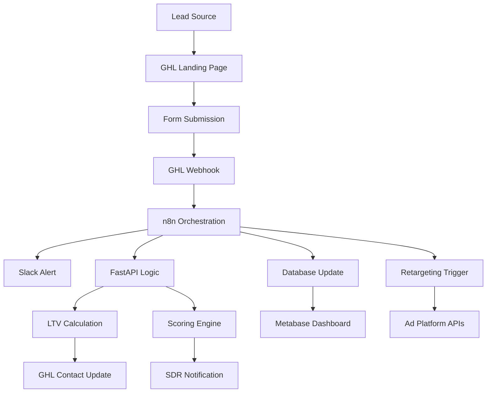

# Luminar Tech Stack Infrastructure: Agentic Architecture, Data Flow, and Implementation Strategy

## Introduction: Designing for Intelligent Scale

Before any workflow or funnel can perform at peak efficiency, the underlying system must be designed to support intelligent orchestration, automation reliability, and agentic extensibility. The Luminar stack achieves this through a unified infrastructure where three core technologies act as the nervous system of the marketing automation engine:

- **GoHighLevel (GHL)**: The CRM and marketing automation command center
- **n8n**: The orchestrator and automation router  
- **FastAPI**: The custom logic and integration engine

Together, these form the operational triad of Luminar's MCP-driven system. Add in external integrations—Slack, Metabase, advertising platforms, databases—and you get a full-stack execution model capable of supporting AI agents, custom triggers, failover handling, and real-time visibility.

This section outlines each layer in detail, shows how data flows between systems, and provides tactical implementation blueprints and strategic leadership insights. This is not just an automation setup—it's a digital nervous system engineered for autonomous growth.

## 1. Core Systems Overview

### 1.1 GoHighLevel (GHL): The Campaign Core

**What it does:**
- Stores all lead, contact, and customer data
- Powers landing pages, checkout flows, booking calendars
- Sends email and SMS campaigns
- Hosts visual automations and workflow builders
- Tracks pipeline status, payments, and conversations
- Manages affiliate tags and partner data

**Why it matters:**
GHL acts as the source of truth for all customer journeys. It collects behavioral signals (page visits, form fills, email opens) and uses them to trigger automation actions and segmentation tags. However, GHL's native automations are limited to single-system logic—this is where n8n extends its power.

**Pro Tip:** Create standardized tags like `src_paid`, `stage_tripwire`, `rt_proreport_abandon` to enable clean workflow routing and AI input prompts later.

### 1.2 n8n: The Orchestration Engine

**What it does:**
- Listens for GHL events via webhooks
- Executes complex, multi-step workflows
- Handles API requests to/from external tools
- Adds failover/retry logic and branching paths
- Updates databases, pushes Slack alerts, and manages conditional flows
- Prepares input/output layers for AI interaction

**Why it matters:**
Think of n8n as the automation layer GHL wishes it had. It turns simple actions into contextual workflows across tools, systems, and channels.

**Example:**
```
GHL tag: bought_tripwire → n8n receives webhook
n8n:
  - Posts a Slack alert to the Sales team
  - Logs sale in an Airtable database
  - Calls FastAPI to calculate LTV projection
  - Sends custom data back to GHL as contact notes
```

**Pro Tip:** Set up a naming convention in n8n like `ghl_trigger_tripwire-purchase_v1` so teams can identify logic lineage and versioning.

### 1.3 FastAPI: Custom Logic & Intelligence Layer

**What it does:**
- Provides API endpoints for AI agents, dashboards, or third-party systems
- Processes complex logic beyond GHL/n8n (e.g., eligibility checks, predictive modeling)
- Stores supplemental data in PostgreSQL or BigQuery
- Receives inbound webhooks from SaaS product platforms
- Sends validated updates back into GHL

**Why it matters:**
FastAPI is the programmable logic bridge that lets your system do anything you can code or model. From agent-controlled webhook endpoints to audit trails for compliance, this layer makes the stack extensible and future-proof.

**Pro Tip:** Build "public-safe" FastAPI endpoints to allow secure calls from affiliate tracking systems or AI agents—e.g., `/update-stage?email=...&new_tag=stage_call_no_show`.

## 2. External Services Integration

### Slack: Real-Time Ops Layer
**Purpose:** Internal alerts, daily digests, system errors

**Trigger Points:**
- SDR booking reminders
- No-show alerts
- Funnel leak detection
- A/B test winners

**Pro Tip:** Create a dedicated Slack channel per funnel stage (e.g., `#leads-tripwire`, `#calls-premium`) and use n8n to route alerts contextually.

### Metabase: Funnel Visibility & KPI Tracking
**Purpose:** Real-time dashboards for ROAS, CVR, CAC, CPL

**Data Sources:** GHL export → n8n → PostgreSQL → Metabase

**Pro Tip:** Build dashboards by campaign type, channel, and funnel stage. Add Slack alerts when metrics fall below thresholds (e.g., Tripwire CVR < 4%).

### Ad Platforms (Meta, Google, LinkedIn)
**Purpose:** Retargeting, conversion tracking, audience syncing

**Automation:**
- GHL tag `abandon_cart` triggers n8n → sends lead ID to Meta custom audience
- Tag `call_no_show` → triggers retargeting video ad

**Pro Tip:** Sync GHL tags to retargeting audiences within 5 minutes of behavior for best conversion lift.

### Stripe & Payment Tools
Integrated via n8n or FastAPI for:
- Order validation
- Refund logic
- Subscription sync
- Payment success/failure tagging in GHL

**Pro Tip:** Use Stripe webhooks to update funnel stage in GHL instantly—no manual reconciliation.

## 3. Data Flow: Visual and Logical Breakdown

### Sample Journey:

1. **Lead enters via ad** → GHL landing page
2. **Submits form** → GHL tags: `src_paid`, `stage_landing_submitted`
3. **GHL webhook triggers n8n:**
   - Sends Slack alert
   - Checks purchase status (via FastAPI)
   - Pushes to Airtable
   - Updates contact with Pro Report invite
4. **Lead purchases Tripwire** → new tag `bought_tripwire`
5. **n8n triggered again:**
   - Creates a trial account in SaaS
   - Starts onboarding drip
   - Notifies SDR if score > 75
6. **Lead books Strategy Call** → new tag `booked_call`
7. **FastAPI receives booking data** → stores metadata + estimated LTV
8. **n8n starts retargeting drip** if call not booked in 3 days

**Strategic Insight:** Every micro-decision above is a chance to trigger content, flag signals, or adjust pacing. Automating these steps reduces human error, response delays, and lost opportunities.

### Data Flow Diagram



## 4. Failover & Redundancy Framework

### GHL's Limitation:
GHL webhooks are fire-and-forget—if n8n is down, you lose the event.

### Redundancy System:
```
n8n receives webhook → processes event
If success:
  - Tag GHL: n8n_success_event_x
If fail:
  - Log failure in DB
  - Alert via Slack
  - Retry every 30 min (up to 3x)

Nightly reconciliation: n8n scans CRM vs. DB to patch gaps
```

**Pro Tip:** Include UUID or timestamp hash in webhook payload to detect duplicates and ensure idempotency.

### Implementation Code Example:

```python
# FastAPI endpoint with failover handling
@app.post("/webhook/ghl-event")
async def handle_ghl_webhook(event: WebhookEvent):
    try:
        # Process event
        result = await process_event(event)
        
        # Tag success in GHL
        await ghl_client.add_tag(
            contact_id=event.contact_id,
            tag=f"n8n_success_{event.event_type}_{datetime.now().strftime('%Y%m%d')}"
        )
        
        return {"status": "success", "event_id": event.id}
        
    except Exception as e:
        # Log failure
        await log_failure(event, str(e))
        
        # Alert via Slack
        await slack_client.send_message(
            channel="#system-alerts",
            text=f"🚨 Webhook processing failed: {event.event_type} - {str(e)}"
        )
        
        # Queue for retry
        await queue_retry(event)
        
        raise HTTPException(status_code=500, detail="Processing failed")
```

## 5. AI Agent-Ready Design

Because all interactions are structured via webhooks, APIs, and tags, the system is 100% agent-compatible.

### An AI agent could:
- Monitor funnel CVR drop and pause ads
- Rewrite subject lines in low-open sequences
- Ping SDRs when score > threshold + trial not activated
- Pull FAQs from contact objections and update landing pages
- Run GET calls to FastAPI for cohort analysis and content reshuffling

### Implementation Tip:
Every automation node should include a `summary_note` field so AI agents can read system context without re-parsing raw payloads.

### AI Agent Integration Example:

```python
# AI Agent API endpoint
@app.post("/ai-agent/optimize-funnel")
async def ai_optimize_funnel(request: OptimizationRequest):
    # Get current funnel metrics
    metrics = await get_funnel_metrics(request.funnel_id)
    
    # AI analysis
    if metrics.conversion_rate < 0.04:  # Below 4%
        # Pause underperforming ads
        await pause_ads(request.campaign_id)
        
        # Generate new subject lines
        new_subjects = await ai_generate_subjects(
            current_subjects=metrics.email_subjects,
            performance_data=metrics.email_performance
        )
        
        # Update email sequences
        await update_email_sequence(request.sequence_id, new_subjects)
        
        # Notify team
        await slack_notify(
            channel="#ai-optimizations",
            message=f"🤖 AI optimized funnel {request.funnel_id}: New subjects deployed, ads paused"
        )
    
    return {"status": "optimized", "actions_taken": ["pause_ads", "update_subjects"]}
```

## 6. Ops Team Training & Implementation Roadmap

### Onboarding Schedule (Weeks 0–3):

**Week 0:** Setup GHL pipelines, tags, workflows, calendars
**Week 1:** Launch first n8n flows: form → Slack, Tripwire → DB
**Week 2:** Deploy FastAPI endpoints + Slack failover alerts
**Week 3:** Start AI scoring/agentic email tests

### Training Tips:
- Document every webhook trigger + n8n flow
- Use consistent naming: `stage_call_booked`, `agent_score_95+`
- Create sandbox flows for new SDRs to test without breaking production
- Store integration diagrams inside ClickUp or Notion SOP workspace
- Schedule monthly "automation audit" sprints

### Implementation Checklist:

#### Phase 1: Foundation (Week 0)
- [ ] GHL account setup and configuration
- [ ] Pipeline and tag standardization
- [ ] Webhook endpoint configuration
- [ ] Basic landing page and form setup

#### Phase 2: Orchestration (Week 1)
- [ ] n8n instance deployment
- [ ] First webhook flows (form submissions)
- [ ] Slack integration and alert channels
- [ ] Basic database logging

#### Phase 3: Intelligence Layer (Week 2)
- [ ] FastAPI application deployment
- [ ] Custom logic endpoints
- [ ] Failover and retry mechanisms
- [ ] Metabase dashboard setup

#### Phase 4: AI Integration (Week 3)
- [ ] AI agent endpoint development
- [ ] Scoring algorithm implementation
- [ ] Automated optimization triggers
- [ ] Performance monitoring setup

### Monitoring and Maintenance:

```python
# Health check endpoint
@app.get("/health")
async def health_check():
    checks = {
        "ghl_connection": await check_ghl_api(),
        "n8n_status": await check_n8n_health(),
        "database": await check_db_connection(),
        "slack_integration": await check_slack_api(),
        "webhook_queue": await check_webhook_queue_health()
    }
    
    all_healthy = all(checks.values())
    
    return {
        "status": "healthy" if all_healthy else "degraded",
        "checks": checks,
        "timestamp": datetime.now().isoformat()
    }
```

## 7. Security and Compliance Considerations

### API Security:
- JWT token authentication for all FastAPI endpoints
- Rate limiting on webhook endpoints
- Input validation and sanitization
- HTTPS enforcement

### Data Privacy:
- GDPR compliance for EU leads
- Data retention policies
- Secure data transmission
- Audit logging

### Access Control:
- Role-based permissions in GHL
- n8n workflow access controls
- FastAPI endpoint authentication
- Slack channel permissions

## 8. Performance Optimization

### Caching Strategy:
```python
from functools import lru_cache
import redis

# Redis cache for frequently accessed data
redis_client = redis.Redis(host='localhost', port=6379, db=0)

@lru_cache(maxsize=1000)
async def get_contact_score(contact_id: str):
    # Cache contact scores for 1 hour
    cached_score = redis_client.get(f"score:{contact_id}")
    if cached_score:
        return json.loads(cached_score)
    
    score = await calculate_contact_score(contact_id)
    redis_client.setex(f"score:{contact_id}", 3600, json.dumps(score))
    return score
```

### Database Optimization:
- Indexed queries for frequent lookups
- Connection pooling
- Async database operations
- Query optimization

### Webhook Processing:
- Async processing for non-critical operations
- Queue management for high-volume events
- Batch processing for bulk operations

## Final Thoughts: Building for the Future

This isn't just about syncing tools—it's about architecting a living, intelligent revenue engine. When you lay down these components correctly:

- **Funnels won't break** - Redundancy and failover ensure continuity
- **SDRs won't chase cold leads** - AI scoring prioritizes high-value prospects
- **Data will drive decisions, not assumptions** - Real-time analytics provide actionable insights
- **And AI can act—not just analyze** - Automated optimization and intelligent routing

With this stack, you're no longer launching manually—you're executing autonomously.

**Welcome to the infrastructure of Luminar.**

---

## Integration with Vibe Marketing Platform

This Luminar architecture integrates seamlessly with the existing Vibe Marketing Automation Platform through:

### MCP Server Integration:
- **Luminar-GHL MCP**: Direct integration with GoHighLevel APIs
- **Luminar-n8n MCP**: Workflow orchestration and monitoring
- **Luminar-FastAPI MCP**: Custom logic and AI agent endpoints

### Dashboard Integration:
- Real-time Luminar metrics in the unified dashboard
- Funnel performance monitoring
- AI agent activity tracking
- System health indicators

### Error Handling Integration:
- Luminar-specific error handling patterns
- Enhanced retry mechanisms for webhook failures
- Comprehensive logging and alerting

This architecture represents the next evolution of the Vibe platform, providing enterprise-grade automation capabilities with AI-first design principles.