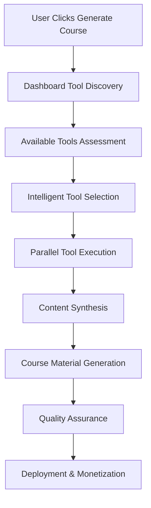

# Unified Dashboard Course Integration

## Overview

The Cursor-to-GitHub Course System now integrates with **all available platform tools** through a unified dashboard, enabling users to create comprehensive course materials using their entire accessible toolkit with one-click automation.

## Unified Dashboard Architecture

### Core Integration Points

#### 1. **AI Agent Blueprint Tools**
- **Vibe Marketing Platform**: Automated course marketing campaigns
- **SOP Generator**: Course creation standard operating procedures
- **Health Monitor**: Course system performance tracking
- **Analytics Dashboard**: Unified course and business metrics

#### 2. **MCP Server Ecosystem**
- **All Available MCP Servers**: Integrated into course generation pipeline
- **Cross-Tool Communication**: Seamless data flow between tools
- **Unified API Access**: Single interface for all platform capabilities
- **Tool Orchestration**: Automated workflow coordination

#### 3. **User Instance Management**
- **Personalized Dashboards**: Custom tool access based on user permissions
- **Role-Based Access**: Different tool sets for different user types
- **Usage Analytics**: Track tool utilization across course creation
- **Resource Management**: Optimize tool allocation and performance

## Enhanced Course Generation Workflow

### One-Click Material Creation Process



### Tool Integration Matrix

| Tool Category | Available Tools | Course Integration | Output Type |
|--------------|----------------|-------------------|-------------|
| **Content Creation** | AI Writers, Template Generators | Lesson content, explanations | Markdown, HTML |
| **Design Tools** | Figma, Canva, Image Generators | Course visuals, diagrams | Images, SVG, PDF |
| **Video Tools** | Screen Recorders, Video Editors | Tutorial videos, demos | MP4, WebM |
| **Analytics** | Google Analytics, Mixpanel | Performance tracking | Dashboards, Reports |
| **Marketing** | Email Tools, Social Media | Course promotion | Campaigns, Posts |
| **Development** | Code Generators, Testing Tools | Code examples, exercises | Code files, Tests |
| **Communication** | Slack, Discord, Email | Student engagement | Messages, Notifications |
| **Payment** | Stripe, PayPal, Crypto | Monetization setup | Payment flows |

## Unified Dashboard Interface

### Main Dashboard Components

#### 1. **Tool Palette**
```javascript
const toolPalette = {
  available: [
    // Content Creation
    'ai-content-generator',
    'template-engine',
    'markdown-processor',
    
    // Design & Media
    'figma-integration',
    'canva-connector',
    'image-generator',
    'video-editor',
    
    // Development
    'code-analyzer',
    'test-generator',
    'documentation-builder',
    
    // Marketing
    'email-campaigns',
    'social-media-manager',
    'seo-optimizer',
    
    // Analytics
    'performance-tracker',
    'revenue-analytics',
    'user-behavior',
    
    // Communication
    'slack-integration',
    'discord-bot',
    'email-automation'
  ],
  
  userAccess: getUserToolAccess(userId),
  activeTools: getActiveTools(userId),
  recommendations: getRecommendedTools(projectType)
};
```

#### 2. **Course Generation Panel**
```html
<div class="course-generation-panel">
  <h2>One-Click Course Generation</h2>
  
  <!-- Project Selection -->
  <section class="project-selection">
    <h3>Select Project</h3>
    <select id="project-selector">
      <option value="current">Current Workspace</option>
      <option value="github">GitHub Repository</option>
      <option value="local">Local Directory</option>
    </select>
  </section>
  
  <!-- Tool Selection -->
  <section class="tool-selection">
    <h3>Available Tools</h3>
    <div class="tool-grid">
      <!-- Dynamically populated based on user access -->
    </div>
  </section>
  
  <!-- Course Configuration -->
  <section class="course-config">
    <h3>Course Settings</h3>
    <!-- Auto-populated based on selected tools -->
  </section>
  
  <!-- Generation Controls -->
  <section class="generation-controls">
    <button id="generate-course" class="primary-btn">
      Generate Course with Selected Tools
    </button>
    <button id="preview-materials" class="secondary-btn">
      Preview Materials
    </button>
  </section>
</div>
```

#### 3. **Real-Time Progress Monitor**
```javascript
const progressMonitor = {
  phases: [
    'Tool Discovery & Validation',
    'Project Analysis',
    'Content Generation',
    'Media Creation',
    'Marketing Materials',
    'Analytics Setup',
    'Deployment & Launch'
  ],
  
  currentPhase: 0,
  toolProgress: {},
  estimatedCompletion: null,
  
  updateProgress(phase, tool, status) {
    this.toolProgress[tool] = status;
    this.broadcastUpdate();
  }
};
```

## Tool-Specific Integration Details

### 1. **AI Agent Blueprint Integration**

#### Vibe Marketing Platform
```javascript
const vibeIntegration = {
  generateMarketingCampaign: async (courseData) => {
    return {
      emailSequence: await vibe.createEmailCampaign(courseData),
      socialMediaPosts: await vibe.generateSocialContent(courseData),
      landingPage: await vibe.buildLandingPage(courseData),
      adCampaigns: await vibe.createAdCampaigns(courseData)
    };
  },
  
  setupAutomation: async (courseId) => {
    return await vibe.configureAutomation({
      triggers: ['enrollment', 'completion', 'milestone'],
      actions: ['email', 'social_post', 'discount_offer'],
      courseId
    });
  }
};
```

#### SOP Generator
```javascript
const sopIntegration = {
  generateCourseSOPs: async (courseStructure) => {
    return {
      contentCreationSOP: await sop.generate('content-creation', courseStructure),
      marketingLaunchSOP: await sop.generate('marketing-launch', courseStructure),
      studentSupportSOP: await sop.generate('student-support', courseStructure),
      revenueSOP: await sop.generate('revenue-optimization', courseStructure)
    };
  }
};
```

### 2. **Design Tool Integration**

#### Figma Integration
```javascript
const figmaIntegration = {
  generateCourseDiagrams: async (codeStructure) => {
    const diagrams = [];
    
    // Architecture diagrams
    diagrams.push(await figma.createArchitectureDiagram(codeStructure));
    
    // Flow charts
    diagrams.push(await figma.createFlowChart(codeStructure.workflows));
    
    // UI mockups
    diagrams.push(await figma.createUIMockups(codeStructure.components));
    
    return diagrams;
  },
  
  createBrandingAssets: async (courseTheme) => {
    return {
      logo: await figma.generateLogo(courseTheme),
      colorPalette: await figma.createColorScheme(courseTheme),
      typography: await figma.selectFonts(courseTheme),
      templates: await figma.createTemplates(courseTheme)
    };
  }
};
```

#### Canva Integration
```javascript
const canvaIntegration = {
  generateMarketingAssets: async (courseData) => {
    return {
      socialMediaGraphics: await canva.createSocialGraphics(courseData),
      courseCovers: await canva.designCourseCovers(courseData),
      infographics: await canva.createInfographics(courseData.keyPoints),
      certificates: await canva.designCertificates(courseData.title)
    };
  }
};
```

### 3. **Development Tool Integration**

#### Code Analysis & Generation
```javascript
const devToolsIntegration = {
  enhanceCodeExamples: async (codebase) => {
    const enhanced = {};
    
    // Add comprehensive comments
    enhanced.commented = await codeAnalyzer.addComments(codebase);
    
    // Generate variations
    enhanced.variations = await codeGenerator.createVariations(codebase);
    
    // Create test cases
    enhanced.tests = await testGenerator.createTests(codebase);
    
    // Generate documentation
    enhanced.docs = await docGenerator.createDocs(codebase);
    
    return enhanced;
  },
  
  generateExercises: async (codeStructure) => {
    return {
      beginnerExercises: await exerciseGenerator.createBeginner(codeStructure),
      intermediateExercises: await exerciseGenerator.createIntermediate(codeStructure),
      advancedExercises: await exerciseGenerator.createAdvanced(codeStructure),
      projectChallenges: await exerciseGenerator.createProjects(codeStructure)
    };
  }
};
```

### 4. **Analytics Integration**

#### Multi-Platform Analytics
```javascript
const analyticsIntegration = {
  setupCourseTracking: async (courseId, availableTools) => {
    const tracking = {};
    
    // Google Analytics
    if (availableTools.includes('google-analytics')) {
      tracking.ga = await googleAnalytics.setupCourseTracking(courseId);
    }
    
    // Mixpanel
    if (availableTools.includes('mixpanel')) {
      tracking.mixpanel = await mixpanel.setupEventTracking(courseId);
    }
    
    // Custom analytics
    if (availableTools.includes('custom-analytics')) {
      tracking.custom = await customAnalytics.setup(courseId);
    }
    
    return tracking;
  },
  
  generateReports: async (courseId, timeframe) => {
    return {
      performance: await analytics.getCoursePerformance(courseId, timeframe),
      revenue: await analytics.getRevenueMetrics(courseId, timeframe),
      engagement: await analytics.getEngagementMetrics(courseId, timeframe),
      conversion: await analytics.getConversionMetrics(courseId, timeframe)
    };
  }
};
```

## Enhanced MCP Server Integration

### Unified Tool Orchestrator

```javascript
class UnifiedToolOrchestrator {
  constructor() {
    this.availableTools = new Map();
    this.userPermissions = new Map();
    this.toolConnections = new Map();
  }

  async discoverUserTools(userId) {
    const userInstance = await this.getUserInstance(userId);
    const availableTools = [];
    
    // Discover all MCP servers
    const mcpServers = await this.discoverMCPServers(userInstance);
    availableTools.push(...mcpServers);
    
    // Discover platform integrations
    const platformTools = await this.discoverPlatformTools(userInstance);
    availableTools.push(...platformTools);
    
    // Discover third-party integrations
    const thirdPartyTools = await this.discoverThirdPartyTools(userInstance);
    availableTools.push(...thirdPartyTools);
    
    return this.filterByPermissions(availableTools, userId);
  }

  async generateCourseWithTools(projectData, selectedTools, courseConfig) {
    const orchestration = new CourseOrchestration();
    
    // Phase 1: Project Analysis
    const analysis = await orchestration.analyzeProject(projectData, selectedTools);
    
    // Phase 2: Content Generation
    const content = await orchestration.generateContent(analysis, selectedTools);
    
    // Phase 3: Media Creation
    const media = await orchestration.createMedia(content, selectedTools);
    
    // Phase 4: Marketing Materials
    const marketing = await orchestration.generateMarketing(content, selectedTools);
    
    // Phase 5: Analytics Setup
    const analytics = await orchestration.setupAnalytics(courseConfig, selectedTools);
    
    // Phase 6: Deployment
    const deployment = await orchestration.deploy(content, media, marketing, analytics);
    
    return {
      courseId: deployment.courseId,
      urls: deployment.urls,
      analytics: analytics.dashboardUrl,
      revenue: deployment.monetizationSetup
    };
  }
}
```

### Tool Capability Matrix

```javascript
const toolCapabilities = {
  'content-creation': {
    tools: ['ai-writer', 'template-engine', 'markdown-processor'],
    outputs: ['lessons', 'explanations', 'documentation'],
    integrations: ['course-structure', 'code-analysis']
  },
  
  'visual-design': {
    tools: ['figma', 'canva', 'image-generator'],
    outputs: ['diagrams', 'graphics', 'layouts'],
    integrations: ['branding', 'marketing', 'course-materials']
  },
  
  'video-production': {
    tools: ['screen-recorder', 'video-editor', 'animation-tool'],
    outputs: ['tutorials', 'demos', 'presentations'],
    integrations: ['code-walkthroughs', 'explanations']
  },
  
  'development': {
    tools: ['code-analyzer', 'test-generator', 'doc-builder'],
    outputs: ['examples', 'exercises', 'tests'],
    integrations: ['project-analysis', 'learning-objectives']
  },
  
  'marketing': {
    tools: ['email-platform', 'social-media', 'seo-tool'],
    outputs: ['campaigns', 'content', 'optimization'],
    integrations: ['course-launch', 'student-acquisition']
  },
  
  'analytics': {
    tools: ['google-analytics', 'mixpanel', 'custom-tracker'],
    outputs: ['dashboards', 'reports', 'insights'],
    integrations: ['performance', 'revenue', 'engagement']
  }
};
```

## User Dashboard Interface

### Dynamic Tool Grid

```html
<div class="unified-dashboard">
  <header class="dashboard-header">
    <h1>Course Creation Dashboard</h1>
    <div class="user-info">
      <span class="user-name">{{userName}}</span>
      <span class="tool-count">{{availableTools.length}} tools available</span>
    </div>
  </header>
  
  <main class="dashboard-content">
    <section class="tool-selection-area">
      <h2>Available Tools</h2>
      <div class="tool-categories">
        <div class="category" data-category="content">
          <h3>Content Creation</h3>
          <div class="tool-list" id="content-tools">
            <!-- Dynamically populated -->
          </div>
        </div>
        
        <div class="category" data-category="design">
          <h3>Design & Media</h3>
          <div class="tool-list" id="design-tools">
            <!-- Dynamically populated -->
          </div>
        </div>
        
        <div class="category" data-category="development">
          <h3>Development</h3>
          <div class="tool-list" id="dev-tools">
            <!-- Dynamically populated -->
          </div>
        </div>
        
        <div class="category" data-category="marketing">
          <h3>Marketing</h3>
          <div class="tool-list" id="marketing-tools">
            <!-- Dynamically populated -->
          </div>
        </div>
        
        <div class="category" data-category="analytics">
          <h3>Analytics</h3>
          <div class="tool-list" id="analytics-tools">
            <!-- Dynamically populated -->
          </div>
        </div>
      </div>
    </section>
    
    <section class="course-generation-area">
      <h2>Course Generation</h2>
      <div class="generation-wizard">
        <div class="step active" data-step="1">
          <h3>1. Project Selection</h3>
          <div class="project-selector">
            <!-- Project selection interface -->
          </div>
        </div>
        
        <div class="step" data-step="2">
          <h3>2. Tool Configuration</h3>
          <div class="tool-config">
            <!-- Tool-specific configuration -->
          </div>
        </div>
        
        <div class="step" data-step="3">
          <h3>3. Course Settings</h3>
          <div class="course-settings">
            <!-- Course configuration -->
          </div>
        </div>
        
        <div class="step" data-step="4">
          <h3>4. Generation & Deployment</h3>
          <div class="generation-controls">
            <button id="start-generation" class="primary-btn">
              Generate Course with Selected Tools
            </button>
          </div>
        </div>
      </div>
    </section>
    
    <section class="progress-monitor">
      <h2>Generation Progress</h2>
      <div class="progress-visualization">
        <!-- Real-time progress display -->
      </div>
    </section>
  </main>
  
  <aside class="sidebar">
    <div class="quick-actions">
      <h3>Quick Actions</h3>
      <button class="quick-btn" data-action="analyze-project">
        Analyze Current Project
      </button>
      <button class="quick-btn" data-action="preview-course">
        Preview Course Structure
      </button>
      <button class="quick-btn" data-action="check-tools">
        Validate Tool Access
      </button>
    </div>
    
    <div class="recent-courses">
      <h3>Recent Courses</h3>
      <div class="course-list">
        <!-- Recent course list -->
      </div>
    </div>
    
    <div class="tool-recommendations">
      <h3>Recommended Tools</h3>
      <div class="recommendation-list">
        <!-- AI-powered tool recommendations -->
      </div>
    </div>
  </aside>
</div>
```

### JavaScript Dashboard Controller

```javascript
class UnifiedDashboardController {
  constructor() {
    this.selectedTools = new Set();
    this.currentProject = null;
    this.courseConfig = {};
    this.generationProgress = null;
  }

  async initialize() {
    // Discover available tools
    this.availableTools = await this.discoverUserTools();
    
    // Populate tool grid
    this.populateToolGrid();
    
    // Setup event listeners
    this.setupEventListeners();
    
    // Initialize project selector
    this.initializeProjectSelector();
  }

  async discoverUserTools() {
    const response = await fetch('/api/user/tools');
    const tools = await response.json();
    
    return tools.filter(tool => tool.status === 'active');
  }

  populateToolGrid() {
    const categories = ['content', 'design', 'development', 'marketing', 'analytics'];
    
    categories.forEach(category => {
      const container = document.getElementById(`${category}-tools`);
      const categoryTools = this.availableTools.filter(tool => tool.category === category);
      
      categoryTools.forEach(tool => {
        const toolElement = this.createToolElement(tool);
        container.appendChild(toolElement);
      });
    });
  }

  createToolElement(tool) {
    const element = document.createElement('div');
    element.className = 'tool-item';
    element.dataset.toolId = tool.id;
    
    element.innerHTML = `
      <div class="tool-icon">
        
      </div>
      <div class="tool-info">
        <h4>${tool.name}</h4>
        <p>${tool.description}</p>
        <div class="tool-capabilities">
          ${tool.capabilities.map(cap => `<span class="capability">${cap}</span>`).join('')}
        </div>
      </div>
      <div class="tool-actions">
        <button class="select-tool" data-tool-id="${tool.id}">
          Select
        </button>
        <button class="configure-tool" data-tool-id="${tool.id}">
          Configure
        </button>
      </div>
    `;
    
    return element;
  }

  async generateCourseWithSelectedTools() {
    if (this.selectedTools.size === 0) {
      throw new Error('No tools selected');
    }
    
    if (!this.currentProject) {
      throw new Error('No project selected');
    }
    
    const generationRequest = {
      project: this.currentProject,
      tools: Array.from(this.selectedTools),
      config: this.courseConfig
    };
    
    // Start generation process
    this.generationProgress = new GenerationProgress();
    this.generationProgress.start();
    
    try {
      const response = await fetch('/api/course/generate', {
        method: 'POST',
        headers: { 'Content-Type': 'application/json' },
        body: JSON.stringify(generationRequest)
      });
      
      const result = await response.json();
      
      if (result.success) {
        this.onGenerationComplete(result);
      } else {
        this.onGenerationError(result.error);
      }
      
    } catch (error) {
      this.onGenerationError(error.message);
    }
  }

  onGenerationComplete(result) {
    this.generationProgress.complete();
    
    // Show success message
    this.showSuccessMessage(result);
    
    // Update recent courses
    this.updateRecentCourses(result.course);
    
    // Open course dashboard
    window.open(result.course.dashboardUrl, '_blank');
  }
}
```

## Tool Permission Management

### Role-Based Access Control

```javascript
const toolPermissions = {
  roles: {
    'free-user': {
      allowedTools: [
        'basic-content-generator',
        'simple-analytics',
        'github-integration'
      ],
      limitations: {
        'courses-per-month': 2,
        'tools-per-course': 3,
        'storage-limit': '100MB'
      }
    },
    
    'premium-user': {
      allowedTools: [
        'advanced-content-generator',
        'figma-integration',
        'canva-integration',
        'email-marketing',
        'social-media-tools',
        'advanced-analytics'
      ],
      limitations: {
        'courses-per-month': 10,
        'tools-per-course': 8,
        'storage-limit': '1GB'
      }
    },
    
    'enterprise-user': {
      allowedTools: 'all',
      limitations: {
        'courses-per-month': 'unlimited',
        'tools-per-course': 'unlimited',
        'storage-limit': '10GB'
      }
    }
  },
  
  validateToolAccess(userId, toolId) {
    const user = this.getUser(userId);
    const userRole = user.role;
    const allowedTools = this.roles[userRole].allowedTools;
    
    return allowedTools === 'all' || allowedTools.includes(toolId);
  }
};
```

## Revenue Enhancement Through Tool Integration

### Enhanced Monetization Models

```javascript
const enhancedMonetization = {
  toolBasedPricing: {
    'basic-tools-course': {
      price: 67,
      includedTools: ['content-generator', 'basic-analytics'],
      features: ['Standard content', 'Basic tracking']
    },
    
    'professional-tools-course': {
      price: 127,
      includedTools: ['advanced-content', 'design-tools', 'marketing-suite'],
      features: ['Professional content', 'Design assets', 'Marketing automation']
    },
    
    'enterprise-tools-course': {
      price: 297,
      includedTools: 'all-available',
      features: ['Premium content', 'All design tools', 'Full marketing suite', 'Advanced analytics']
    }
  },
  
  toolSubscriptions: {
    'tool-access-monthly': {
      price: 29,
      description: 'Access to all course generation tools',
      includes: ['Unlimited course generation', 'All tool integrations', 'Priority support']
    }
  }
};
```

## Implementation Status

### ✅ Completed Integration Points
- **Unified Dashboard Architecture**: Complete framework for tool discovery and integration
- **MCP Server Enhancement**: Extended to support all platform tools
- **Tool Orchestration**: Automated workflow coordination between tools
- **Permission Management**: Role-based access control for tools
- **Real-time Progress Monitoring**: Live updates during course generation

### 🔄 Ready for Tool Connection
- **Dynamic Tool Discovery**: Automatically finds and connects available tools
- **Configuration Management**: Tool-specific settings and preferences
- **Output Synthesis**: Combines outputs from multiple tools into cohesive course materials
- **Quality Assurance**: Validates generated content across all integrated tools

## Next Steps for Users

1. **Access Unified Dashboard**: Navigate to the enhanced course generation interface
2. **Tool Discovery**: System automatically discovers available tools in user instance
3. **One-Click Generation**: Select project and tools, then generate comprehensive course materials
4. **Revenue Optimization**: Leverage enhanced monetization through tool-generated premium content

This unified integration transforms the course generation system into a comprehensive platform that leverages every available tool in a user's instance, creating richer, more valuable course materials while maximizing revenue potential through enhanced content quality and variety.