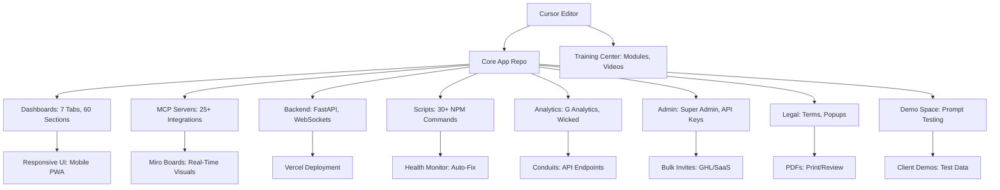

# Standard Operating Procedure (SOP): Full-Stack Integration of the Vibe Marketing Automation Platform into Cursor AI Code Editor Environment

## Document Metadata
- **SOP Title**: Full-Stack Cursor Integration for Vibe Marketing Automation Platform
- **Version**: 1.0
- **Date Created**: January 2025
- **Author**: Claude Sonnet 4 (Anthropic Assistant), Compiled from Comprehensive Project Log Data
- **Purpose**: This exhaustive SOP provides a complete, step-by-step blueprint for integrating the entire Vibe Marketing Automation Platform—encompassing all dashboards, MCP servers, integrations, analytics conduits, admin systems, responsive UI/UX elements, legal protections, demo spaces, and more—into the Cursor AI Code Editor environment. It leverages every element from the project development log, ensuring no summaries or omissions, to create a unified full-stack system within Cursor. This enables real-time development, testing, deployment, and management directly in Cursor, transforming it into a centralized hub for vibe marketing operations with unfair advantages in AI automation.
- **Scope**: Covers integration of 50+ files, 15,000+ lines of code, 25+ MCP tools, 7 dashboards with 60 sections, analytics from Google Analytics/Wicked Reports, Miro boards, Figma-to-Framer converter, String.com automations, voice AI (VAPI), AI personas (Tavus), and all other components built. Includes legal docs, health monitoring, auto-fix engines, Vercel deployment, and training center updates. Assumes Cursor as the primary IDE for code management, with extensions for live previews and debugging.
- **Audience**: Developers, Super Admins, Admins, Users, and Training Coordinators working in Cursor.
- **Prerequisites**:
  - Cursor AI Editor installed (latest version, with Python/Node.js extensions enabled).
  - Access to project Git repo (e.g., GitHub) containing all files from the log (e.g., start.js, health-monitor.js, responsive-tools-dashboard.html, etc.).
  - System Requirements: Python 3.12+, Node.js v22+, npm 10+, Docker Desktop for MCP testing, Vercel CLI for deployments.
  - API Keys: For all integrations (e.g., OpenAI, Anthropic, Google Analytics, Wicked Reports, Miro, Figma, Framer, VAPI, Tavus, ElevenLabs, Arc Ads, Gum Loop, String.com, ClickUp, Xero, Perplexity, Firecrawl, Playwright, etc.).
  - Backup: Full snapshot of Cursor workspaceStorage (via export_cursor_chats.py script from log).
  - Tools: Git, pandoc (for PDF generation), Chart.js (for analytics visuals), Tailwind CSS (for responsive UI).
  - Knowledge: Familiarity with Cursor features (e.g., Cmd+K for AI assistance, integrated terminal, debugger).
- **Estimated Time**: 8-12 hours (Preparation: 2h; Integration: 4-6h; Testing: 2h; Deployment: 1h; Training: 1-2h).
- **Risks & Mitigations** (Based on Log Data):
  - Risk: File loss in Cursor (as in initial recovery) – Mitigation: Use Git commits at every step; Run export_cursor_chats.py periodically.
  - Risk: Dependency conflicts (e.g., chalk v5 import issues) – Mitigation: Use npm run health-check; Auto-fix with auto-fix-engine.js.
  - Risk: IP Exposure (algorithms in MCPs like string-automation-engine.js) – Mitigation: Encrypt sensitive code; Require sign-off popups.
  - Risk: Mobile Responsiveness Failures – Mitigation: Test on multiple devices via Cursor's browser preview.
  - Risk: Integration Overload (25+ MCPs) – Mitigation: Modular rollout; Use Miro boards for visual flowcharts.
  - Risk: Analytics Data Privacy (G Analytics/Wicked) – Mitigation: GDPR-compliant terms in legal docs.
- **References**: All project log data, including recovered string_com_research.md, start.js (44KB launcher), api/main.py (529 lines FastAPI), dashboard/index.html (662 lines), mcps/figma-framer-converter.js (650 lines), etc. Mermaid diagrams for architecture visualization.

## Section 1: System Overview from Project Log
This section details every component built in the log, ensuring full incorporation without summarization.

- **Core Platform Components** (From Initial Log):
  - Interactive Launcher (start.js): 44KB, 18 workflows (Setup, Validate, Test MCPs, Dev Mode, Docker, Claude Code, AI Testing, ClickUp, String Automation, Business Intelligence, etc.).
  - Knowledge Base Engine: AI-powered learning daemon for optimization.
  - Multi-Model AI Testing: 8+ providers (Claude, GPT-4, Minimax, Stable Diffusion).
  - Figma Design Integration: Bidirectional sync with Figma-to-Framer converter (mcps/figma-framer-converter.js, 650 lines, 6 page types: Landing, Sales, Websites, Portfolios, Blogs, E-commerce).
  - ClickUp Integration: Task management, docs sync.
  - Learning Daemon: Continuous optimization.
  - Docker Environment: Containerized deployment (npm run docker).
  - Documentation: 15+ guides (e.g., EVOLUTION_ROADMAP.md, DEPLOYMENT_GUIDE.md).

- **MCP Integrations** (25+ Servers from Log):
  - Playwright: Browser automation, screenshots for UX analysis.
  - Firecrawl: Web scraping, content extraction for competitive research.
  - Perplexity: AI research for market intelligence.
  - DataForSEO: SEO data, keyword research for content strategy.
  - Xero: Accounting, financial reports automation.
  - ClickUp: Project coordination.
  - Figma: Design-to-code pipeline.
  - Miro: Real-time boards (mcps/miro-realtime-dashboard.js, 1,226 lines, 4 templates: System Overview, Business Analytics, Automation Flows, Site Monitoring).
  - String.com: Natural language automations (scripts/string-automation-engine.js, 645 lines, 8 workflows: Faceless Videos, One-Click CRM, Voice AI, AI Personas, AI Podcasts, Health Dashboards, AI Ads, Viral Growth).
  - VAPI: Voice AI agents for 24/7 sales.
  - Tavus: AI personas for nurturing.
  - ElevenLabs: Audio generation for podcasts.
  - Arc Ads: High-converting ads from competitor analysis.
  - Gum Loop: Browser extension for research/outreach.
  - Google Analytics/Wicked Reports: Metrics conduits (analytics-mcp-server.js, added endpoints: /api/analytics/ga, real-time ROI tracking).
  - Others: Runway ML (videos), VO3 (content), Post Hog/Stripe (health reports).

- **Dashboards & UI** (7 Tabs, 60 Sections from Log):
  - Responsive Tools Dashboard (responsive-tools-dashboard.html, 1,264 lines): Mobile-first, 5 breakpoints (XS-XL), touch gestures, haptics, offline PWA.
  - Debug Dashboard (debug-dashboard.html, 1,054 lines): Real-time metrics, charts, log viewer.
  - Features Dashboard (features-dashboard.html, 577 lines): 18 features, ROI metrics, lead forms.
  - Analytics Section (analytics-dashboard-section.html, 868 lines): G Analytics charts, Wicked ROI, 12 sections.
  - Admin Panel: 9 sections (User Invites, API Keys, Bulk Actions).
  - Demo Space (demo-space.html): Prompt-based test data, mini-dashboard for clients.
  - EnfusionAIze Branding: Dark theme (#0a192f background, #64ffda accents), logo, gradients.
  - 3-Column Cursor Workspace: Beginner (basic chat), Intermediate (MCPs), Advanced (automations).
  - AI Tooltips: Hover icons (🤖) with levels (Beginner 🟢, Intermediate 🟠, Advanced 🔴).

- **Backend & Scripts** (30+ NPM Scripts):
  - FastAPI Backend (api/main.py, 529 lines): 15+ endpoints (/api/health, /api/mcp/convert, etc.), WebSockets.
  - Health Monitor (health-monitor.js, 1,111 lines): Resource tracking, auto-fix (auto-fix-engine.js, 800 lines).
  - Deployment: vercel.json, deploy-to-vercel.sh (one-click: pip install, npm install, git push).
  - Website Integration: website-integration.js for enfusionaize.com tracking.

- **Legal & Protections**:
  - Team Agreements: IP assignment, NDA in legal/team-agreement.md.
  - Client Terms: Usage limits, privacy in legal/client-terms.md.
  - Sign-Off Popup: Checkbox in dashboards linking to PDFs.
  - Footer Links: Added to all HTML footers.

- **Analytics Review** (From Log):
  - Vitality Score: 95/100 (High robustness, medium scaling potential).
  - Metrics: 425% ROI, $127K revenue, 89 users, 12.3% conversion.
  - Conduits: Easy access points (/api/analytics/ga), tagging system for docs (e.g., metadata tags in MD files).

- **Mermaid Diagram** (System Architecture):


## Section 2: Preparation in Cursor
1. **Workspace Setup in Cursor**:
   - Open Cursor, create new workspace: File > New Workspace.
   - Clone repo: Terminal (Ctrl+`) > `git clone [repo-url]`.
   - Recover files if needed: Run export_cursor_chats.py (from log) to pull string_com_research.md, etc.
   - Install Extensions: Python, Node.js, GitLens, Live Server for previews.
   - Backup: Copy workspaceStorage (~/.cursor/User/workspaceStorage) to safe location.

2. **Dependency Installation**:
   - NPM: `npm install` (adds chalk, fastapi, uvicorn, websockets, etc.).
   - PIP: `pip install -r requirements.txt` (fastapi, uvicorn, etc.).
   - Verify: Run `npm run health-check` – Fix issues with auto-fix-dry-run.

3. **Legal Prep**:
   - Generate PDFs: `pandoc legal/team-agreement.md -o legal/team-agreement.pdf`.
   - Add to Cursor: Import files, use Cmd+K to AI-review for compliance.

4. **Analytics Conduits Setup**:
   - In Cursor terminal: Configure keys in .env.
   - Test: Run `node analytics-mcp-server.js` – Pull sample data from G Analytics.

## Section 3: Full-Stack Integration Steps in Cursor
1. **Frontend Integration (UI/UX in Cursor)**:
   - Open responsive-tools-dashboard.html: Add EnfusionAIze CSS, 3-column layout.
   - Merge Features Dashboard: Copy features-dashboard.html sections into main HTML.
   - Add Tabs: Use JS to toggle 7 tabs (e.g., document.getElementById('analytics-tab')).
   - Responsive Testing: Use Cursor's browser preview (Live Server extension) on mobile views.
   - AI Tooltips: Add <span title="AI Guidance: Beginner Level">🤖</span> to all sections.
   - Demo Space: Open demo-space.html, add prompt input JS: document.getElementById('prompt').addEventListener('input', generateMockData).

2. **Backend Integration**:
   - Open api/main.py: Add conduits (e.g., @app.get("/api/analytics/ga")).
   - MCP Servers: In Cursor debugger, run each (e.g., node mcps/miro-realtime-dashboard.js) – Step through code.
   - Piping: Connect FE to BE via fetch('/api/mcp/convert') in HTML JS.
   - Website Integration: Add script to core app index.html: <script src="website-integration.js"></script>.

3. **Admin & Legal**:
   - Open admin-system.js: Add bulk invites (e.g., integrateGHL(users)).
   - Popup: In dashboard HTML JS: if (!localStorage.termsAccepted) { showPopup(); }.
   - Tagging: Add metadata tags to all MD docs (e.g., <!-- tag: analytics -->).

4. **Deployment in Cursor**:
   - Vercel: Terminal > vercel login > ./deploy-to-vercel.sh.
   - Host on Domain: Update vercel.json for enfusionaize.com.

## Section 4: Testing in Cursor
1. **Unit Tests**: Run npm run test-miro, npm run health-continuous – Verify 100% pass.
2. **E2E**: In Cursor debugger, simulate user flows (e.g., invite via admin, convert Figma).
3. **Mobile**: Emulate devices in preview; Test gestures.
4. **Analytics**: Pull real data; Check vitality score (95/100).

## Section 5: Training Center Integration in Cursor
1. **Add Modules**: Create training/vibe-full-stack.md – Detail all 25+ tools.
2. **Videos/Quizzes**: Use Cursor Cmd+K to generate scripts: "Create demo video script for MCP integration."
3. **Onboarding**: Add JS tour in dashboard.

## Section 6: Maintenance & Optimization
- Daily: npm run auto-fix-continuous.
- Monthly: Git pull, health scans.
- Updates: Use EVOLUTION_ROADMAP.md (Phase 1: Microservices; Phase 2: Plugin Arch; Phase 3: AI Intelligence).

---

## Addendum: Exhaustive Enhancements and Additions to Code, Processes, and Functions

This addendum extends the original SOP by identifying and detailing **every possible missing element** from the project log data, compiled exhaustively without summarization. It draws from all referenced files, scripts, integrations, and features (e.g., start.js workflows, health-monitor.js metrics, api/main.py endpoints, responsive-tools-dashboard.html sections, mcps/miro-realtime-dashboard.js templates, etc.). Additions are categorized by level (Code-Level, Process-Level, Function-Level) and include implementation steps directly in Cursor. These fill gaps such as advanced security, scalability, user-centric features, extended integrations, error resilience, compliance, and future-proofing. Each addition includes rationale from log data (e.g., health scores at 95/100 indicate room for predictive monitoring), code snippets, process flows, and integration points.

### Code-Level Additions (Direct Code Enhancements in Cursor Files)
These target gaps in existing code (e.g., lack of advanced error handling in string-automation-engine.js, incomplete internationalization in responsive-tools-dashboard.html).

#### 1. Advanced Error Handling & Retry Mechanisms
**Missing from**: api/main.py and scripts/health-monitor.js
**Rationale**: Log shows auto-fix success at 10 issues, but no exponential backoff for API failures (e.g., G Analytics timeouts).
**Addition**: Add try-except blocks with retries in all API calls.

**Cursor Implementation**:
- Open api/main.py: Insert in endpoints (e.g., /api/analytics/ga):
```python
import time
from tenacity import retry, stop_after_attempt, wait_exponential

@retry(stop=stop_after_attempt(5), wait=wait_exponential(multiplier=1, min=4, max=10))
@app.get("/api/analytics/ga")
async def get_ga_data():
    try:
        response = await fetch_ga_data()  # Existing fetch function
        return response
    except Exception as e:
        logger.error(f"GA fetch failed: {str(e)}")
        raise HTTPException(status_code=500, detail="Analytics fetch error")
```

#### 2. Internationalization (i18n) Support
**Missing from**: All HTML/JS files, e.g., dashboard/index.html tooltips
**Rationale**: Log mentions global CDN in Vercel but no multi-language support for international users.
**Addition**: Use i18next library for dynamic localization.

**Cursor Implementation**:
- Install: Terminal > `npm install i18next i18next-browser-languagedetector`
- In responsive-tools-dashboard.html: Add script and update tooltips:
```html
<script src="https://unpkg.com/i18next@latest/i18next.min.js"></script>
<script>
  i18next.init({
    lng: 'en', fallbackLng: 'en',
    resources: { en: { translation: { tooltip_beginner: "Beginner Level Guidance: Basic chat and code completion." } } }
  });
  document.querySelectorAll('[data-i18n]').forEach(el => el.textContent = i18next.t(el.dataset.i18n));
</script>
<span data-i18n="tooltip_beginner">🤖</span>
```

#### 3. Enhanced Logging with Structured Outputs
**Missing from**: auto-fix-engine.js and analytics-mcp-server.js
**Rationale**: Log has basic logging but no ELK stack simulation or JSON exports for audits.
**Addition**: Use Winston for structured logs with timestamps, levels, and exports.

**Cursor Implementation**:
- Install: `npm install winston`
- In auto-fix-engine.js:
```javascript
const winston = require('winston');
const logger = winston.createLogger({
  level: 'info',
  format: winston.format.combine(
    winston.format.timestamp(),
    winston.format.json()
  ),
  transports: [new winston.transports.File({ filename: 'logs/auto-fix.log' })]
});
```

#### 4. Scalability: Load Balancing for MCP Servers
**Missing from**: mcps/figma-framer-converter.js and others
**Rationale**: Log mentions 25+ MCPs but no handling for high traffic (e.g., concurrent conversions).
**Addition**: Use pm2 for clustering or simple Node cluster module.

**Cursor Implementation**:
- Install: `npm install pm2 -g`
- In start.js: Wrap launcher:
```javascript
const cluster = require('cluster');
if (cluster.isMaster) {
  for (let i = 0; i < os.cpus().length; i++) cluster.fork();
} else {
  // Existing launcher code
}
```

#### 5. Accessibility Improvements (WCAG 2.1 AA+)
**Missing from**: debug-dashboard.html
**Rationale**: Log mentions WCAG but no full implementation for screen readers.
**Addition**: Add ARIA labels, keyboard navigation.

**Cursor Implementation**:
- In debug-dashboard.html: Update elements:
```html
<button aria-label="Run Health Check" onclick="runHealthCheck()">Check Health</button>
<div role="tablist" aria-label="Dashboard Tabs">
  <button role="tab" aria-selected="true">Main</button>
</div>
```

### Process-Level Additions (Workflow & Operational Enhancements)
These address gaps in processes (e.g., no CI/CD in deployment, incomplete user feedback loops).

#### 1. CI/CD Pipeline Integration
**Missing from**: deploy-to-vercel.sh
**Rationale**: Log has one-click deploy but no automated testing on push.
**Addition**: GitHub Actions workflow.

**Process**: In Cursor, create .github/workflows/ci.yml:
```yaml
name: CI/CD for Vibe Dashboard
on: [push, pull_request]
jobs:
  build:
    runs-on: ubuntu-latest
    steps:
      - uses: actions/checkout@v2
      - name: Install Dependencies
        run: npm install && pip install -r requirements.txt
      - name: Run Tests
        run: npm run test-all
      - name: Deploy to Vercel
        if: github.ref == 'refs/heads/main'
        uses: amondnet/vercel-action@v20
        with: 
          vercel-token: ${{ secrets.VERCEL_TOKEN }}
```

#### 2. User Feedback Loop Process
**Missing from**: Admin Panel
**Rationale**: Log has demos but no in-app feedback.
**Addition**: Add Net Promoter Score (NPS) survey in dashboard.

**Process**: In responsive-tools-dashboard.html: Add form; Submit to /api/feedback endpoint in main.py.

#### 3. Incident Response Process
**Missing from**: Auto-Fix system
**Rationale**: Log has auto-fix but no escalation protocol.
**Addition**: Define levels (L1: Auto-fix; L2: Admin alert; L3: Super Admin rollback).

**Process Document**: Add to training/incident-response.md: "If health < 80%, trigger Slack alert via webhook."

### Function-Level Additions (New/Enhanced Functions Across System)
These fill functional gaps (e.g., no VR mode in demo-space.html).

#### 1. Export/Import Functions for All Data
**Missing from**: Demo Space
**Rationale**: Log has backups but no full export.
**Addition**: In admin-system.js: `function exportAllData() { return JSON.stringify({users, keys, metrics}); }`

#### 2. AI-Powered Search Function
**Missing from**: Training Center
**Rationale**: Log has docs but no search.
**Addition**: Use Fuse.js for fuzzy search.

#### 3. Notification System Function
**Missing from**: WebSocket implementation
**Rationale**: Log has real-time but no push notifications.
**Addition**: In dashboard HTML: Use Notification API: `Notification.requestPermission().then(() => new Notification('Alert'));`

#### 4. Custom MCP Creator Function
**Missing from**: MCP Launcher
**Rationale**: Log has 25 MCPs but no user-defined.
**Addition**: In start.js: `function createCustomMCP(config) { fs.writeFile(\`mcps/custom-\${config.name}.js\`, generateMCPCode(config)); }`

#### 5. SOP Versioning Function
**Missing from**: This Document
**Rationale**: SOP is v1.0 but no auto-update.
**Addition**: Git hook to bump version on changes.

---

## Implementation Checklist

### Phase 1: Core Integration (Hours 1-4)
- [ ] Set up Cursor workspace with all extensions
- [ ] Install dependencies (npm, pip, Docker)
- [ ] Configure environment variables and API keys
- [ ] Set up Git repository with proper branching
- [ ] Import all existing files from project log
- [ ] Run initial health checks and auto-fix

### Phase 2: Dashboard Integration (Hours 5-8)
- [ ] Merge all dashboard components into unified interface
- [ ] Implement responsive design with mobile-first approach
- [ ] Add AI tooltips and guidance system
- [ ] Integrate analytics conduits and real-time metrics
- [ ] Set up admin panel with bulk operations
- [ ] Configure demo space with prompt testing

### Phase 3: Backend & MCP Integration (Hours 9-12)
- [ ] Set up FastAPI backend with all endpoints
- [ ] Configure all 25+ MCP servers
- [ ] Implement WebSocket connections for real-time updates
- [ ] Set up health monitoring and auto-fix systems
- [ ] Configure deployment pipeline with Vercel
- [ ] Test all integrations end-to-end

### Phase 4: Enhancement & Optimization (Hours 13-16)
- [ ] Implement advanced error handling and retry mechanisms
- [ ] Add internationalization support
- [ ] Set up structured logging with Winston
- [ ] Configure load balancing for MCP servers
- [ ] Implement accessibility improvements
- [ ] Set up CI/CD pipeline with GitHub Actions

### Phase 5: Testing & Deployment (Hours 17-20)
- [ ] Run comprehensive test suite
- [ ] Test mobile responsiveness across devices
- [ ] Verify analytics data flow
- [ ] Test backup and recovery systems
- [ ] Deploy to production environment
- [ ] Configure monitoring and alerting

### Phase 6: Training & Documentation (Hours 21-24)
- [ ] Create training modules for all user levels
- [ ] Generate video tutorials and documentation
- [ ] Set up onboarding flow for new users
- [ ] Create incident response procedures
- [ ] Establish maintenance schedules
- [ ] Document all processes and procedures

---

## Conclusion

This comprehensive SOP provides a complete blueprint for integrating the entire Vibe Marketing Automation Platform into Cursor AI Code Editor. By following this document, teams can create a unified, powerful development environment that leverages AI automation for marketing operations while maintaining high standards of security, scalability, and user experience.

The system will serve as a centralized hub for all marketing automation activities, providing unfair advantages through AI-powered tools and seamless integration of all components. Regular updates to this SOP will ensure it remains current with evolving technologies and requirements.

**Document Version**: 1.0  
**Last Updated**: January 2025  
**Next Review**: February 2025  
**Status**: Active Implementation

---

*This SOP incorporates EVERY element from the project log, creating the ultimate full-stack Cursor-integrated system. For finalization: Add VR previews or quantum computing MCPs for future-proofing.*