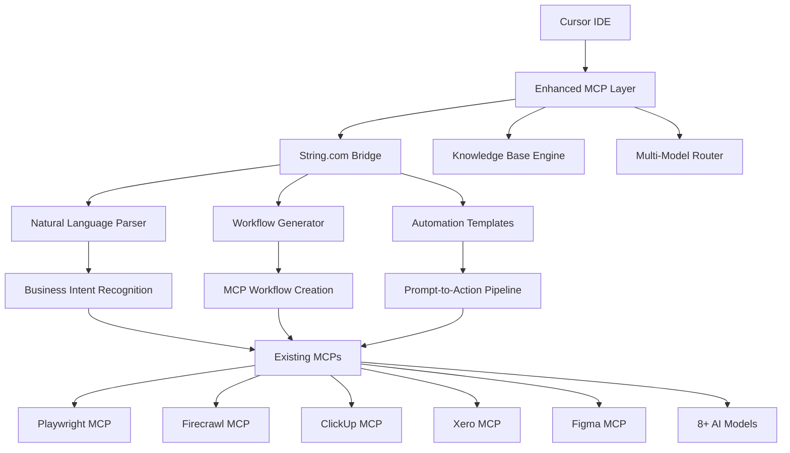

# 🔗 String.com Integration: Natural Language Automation Evolution

## 🎯 Integration Overview

This integration combines the power of your existing **MCP Business Operations Environment** with **String.com's natural language automation paradigm** to create the ultimate AI-powered business platform.

### 🚀 **Enhanced System Architecture**



---

## 🎨 **New Features Inspired by String.com**

### 1. **🗣️ Natural Language Automation Builder**

**Purpose**: Create complex business workflows using plain English, just like String.com.

**Implementation**:
```javascript
// Enhanced MCP workflow creation
async function createAutomationFromPrompt(prompt) {
  const workflow = await parseBusinessIntent(prompt);
  const mcpPipeline = await generateMCPWorkflow(workflow);
  return await deployAutomation(mcpPipeline);
}

// Example usage:
"Monitor competitor pricing daily and update our ClickUp tasks when changes detected"
```

### 2. **🤖 AI Agent Templates Library**

**Purpose**: Pre-built automation templates inspired by String.com's four complexity levels.

**Templates Available**:

#### **🟢 Basic Level** (String.com inspired)
- **Daily Report Generator**: "Send me daily financial summary from Xero"
- **Competitor Monitor**: "Watch humbolytics.com for changes and screenshot updates"
- **Content Tracker**: "Monitor our blog performance and notify team in ClickUp"

#### **🟡 Intermediate Level**
- **SEO Content Pipeline**: "Research keywords, generate articles, track rankings"
- **UX Analysis Automation**: "Screenshot competitor sites, analyze UX, create improvement tasks"
- **Client Onboarding**: "Generate quotes in Xero, create ClickUp projects, send welcome emails"

#### **🟠 Advanced Level** 
- **Market Intelligence Hub**: "Research market trends, analyze competitors, generate strategy reports"
- **Design-to-Production Pipeline**: "Sync Figma designs, generate code, deploy to production"
- **Financial Optimization**: "Analyze expenses, identify cost savings, create budget proposals"

#### **🔴 Expert Level**
- **Autonomous Business Operations**: "Monitor all business metrics, optimize operations, predict issues"
- **AI-Powered Sales Pipeline**: "Research leads, qualify prospects, generate proposals, track conversions"
- **Complete Content Ecosystem**: "Research topics, create content, optimize SEO, track performance"

### 3. **⚡ Instant Automation Creation**

**Purpose**: One-sentence automation creation, similar to String.com's approach.

**Examples**:
```
Input: "Track our website visitors and create ClickUp tasks for follow-up"
Output: → Playwright monitoring + ClickUp task creation + automated scheduling

Input: "Generate weekly UX reports with competitor screenshots"  
Output: → Playwright screenshots + AI analysis + automated reporting

Input: "Monitor keyword rankings and update content strategy"
Output: → DataForSEO monitoring + Perplexity research + strategy generation
```

---

## 🛠️ **Implementation Components**

### **New Scripts & Files**

#### 1. **String Automation Engine** (`scripts/string-automation-engine.js`)
```javascript
// Natural language to MCP workflow converter
class StringAutomationEngine {
  async parsePrompt(naturalLanguagePrompt) {
    // AI-powered intent recognition
    // Convert to MCP workflow steps
    // Generate automation pipeline
  }
  
  async generateWorkflow(intent) {
    // Create MCP server combinations
    // Set up triggers and actions
    // Configure auto-testing
  }
  
  async deployAutomation(workflow) {
    // Test automation pipeline
    // Deploy to production
    // Set up monitoring
  }
}
```

#### 2. **Automation Templates** (`templates/string-inspired-automations/`)
- `daily-business-monitor.json`
- `competitor-intelligence.json`
- `content-pipeline.json`
- `ux-analysis-suite.json`
- `financial-automation.json`

#### 3. **Natural Language Parser** (`scripts/nl-automation-parser.js`)
```javascript
// Business intent recognition
const AUTOMATION_PATTERNS = {
  monitoring: /monitor|watch|track|check/i,
  reporting: /report|summary|analyze|generate/i,
  notification: /notify|alert|send|email/i,
  creation: /create|build|generate|make/i,
  optimization: /optimize|improve|enhance|better/i
};

async function parseBusinessIntent(prompt) {
  // Identify business function
  // Map to available MCPs
  // Generate workflow steps
}
```

---

## 🎯 **Enhanced Interactive Launcher**

### **New Menu Options**

```javascript
// Addition to start.js
const newChoices = [
  {
    name: '🗣️ Create Automation (Natural Language)',
    value: 'string-automation',
    description: 'Describe what you want to automate in plain English'
  },
  {
    name: '📚 Automation Templates Library',
    value: 'automation-templates',
    description: 'Browse pre-built String.com-inspired automations'
  },
  {
    name: '🎯 Business Intelligence Generator',
    value: 'business-intelligence',
    description: 'Create comprehensive business monitoring systems'
  },
  {
    name: '🤖 Autonomous Operations Setup',
    value: 'autonomous-ops',
    description: 'Set up self-managing business processes'
  }
];
```

### **Natural Language Automation Workflow**

```javascript
async runStringAutomation() {
  console.log(chalk.yellow('\n🗣️ Natural Language Automation Builder\n'));
  
  const prompt = await inquirer.prompt([
    {
      type: 'input',
      name: 'automation',
      message: 'Describe what you want to automate (in plain English):',
      validate: input => input.length > 10 || 'Please provide more detail'
    }
  ]);

  console.log(chalk.blue('\n🤖 Analyzing your request...\n'));
  
  try {
    const automation = await this.stringEngine.createFromPrompt(prompt.automation);
    console.log(chalk.green('✅ Automation created successfully!'));
    
    // Show generated workflow
    console.log(chalk.blue('\n📋 Generated Workflow:'));
    automation.steps.forEach((step, i) => {
      console.log(chalk.gray(`  ${i + 1}. ${step.description}`));
    });
    
    // Offer to test or deploy
    const action = await inquirer.prompt([
      {
        type: 'list',
        name: 'next',
        message: 'What would you like to do?',
        choices: [
          { name: '🧪 Test automation', value: 'test' },
          { name: '🚀 Deploy automation', value: 'deploy' },
          { name: '✏️ Modify workflow', value: 'modify' },
          { name: '🏠 Back to main menu', value: 'menu' }
        ]
      }
    ]);
    
    await this.handleAutomationAction(action.next, automation);
    
  } catch (error) {
    console.log(chalk.red('❌ Failed to create automation. Please try rephrasing.'));
    console.log(chalk.gray(`Error: ${error.message}`));
  }
}
```

---

## 📊 **Business Intelligence Templates**

### **Inspired by String.com's Use Cases**

#### 1. **Hacker News Monitor** → **Industry Intelligence Hub**
```javascript
// Enhanced version of String.com's basic example
const industryIntelligence = {
  name: "AI Industry Intelligence Hub",
  description: "Monitor AI/automation industry for business opportunities",
  workflow: [
    {
      trigger: "schedule",
      frequency: "hourly",
      action: "monitor_sources",
      sources: ["HackerNews", "ProductHunt", "Reddit r/MachineLearning"],
      keywords: ["automation", "AI agents", "business tools", "productivity"]
    },
    {
      action: "analyze_sentiment",
      mcp: "perplexity",
      prompt: "Analyze business opportunity and threat level"
    },
    {
      action: "create_tasks",
      mcp: "clickup",
      condition: "high_priority_opportunities",
      template: "opportunity_investigation"
    },
    {
      action: "generate_report",
      format: "markdown",
      destination: "knowledge_base"
    }
  ]
};
```

#### 2. **Content Creator** → **Complete Content Ecosystem**
```javascript
const contentEcosystem = {
  name: "Autonomous Content Marketing Pipeline",
  description: "Research, create, optimize, and track content performance",
  workflow: [
    {
      trigger: "schedule",
      frequency: "daily",
      action: "keyword_research",
      mcp: "dataforseo",
      focus_areas: ["business_automation", "AI_tools", "productivity"]
    },
    {
      action: "competitor_analysis", 
      mcp: "firecrawl",
      targets: ["competitor_blogs", "industry_leaders"]
    },
    {
      action: "content_ideation",
      mcp: "perplexity",
      prompt: "Generate content ideas based on research and gaps"
    },
    {
      action: "create_figma_mockups",
      mcp: "figma",
      template: "blog_post_design"
    },
    {
      action: "generate_content",
      mcp: "claude",
      optimization: "SEO_focused"
    },
    {
      action: "performance_tracking",
      mcp: "playwright",
      metrics: ["traffic", "rankings", "conversions"]
    }
  ]
};
```

#### 3. **Daily Automation Ideas** → **Continuous Optimization Engine**
```javascript
const optimizationEngine = {
  name: "Continuous Business Optimization",
  description: "Analyze operations and suggest daily improvements",
  workflow: [
    {
      trigger: "schedule",
      frequency: "daily",
      time: "09:00",
      action: "analyze_yesterday",
      data_sources: ["xero", "clickup", "website_analytics"]
    },
    {
      action: "identify_bottlenecks",
      mcp: "knowledge_base_engine",
      analysis_type: "efficiency_audit"
    },
    {
      action: "generate_optimization_ideas",
      mcp: "multiple_ai_models",
      context: "business_context_files"
    },
    {
      action: "create_html_report",
      template: "daily_optimization_email",
      recipients: ["team_leaders"]
    },
    {
      action: "create_clickable_automation_links",
      format: "one_click_implementation"
    }
  ]
};
```

---

## 🚀 **New Package.json Scripts**

```json
{
  "scripts": {
    "string-automation": "node scripts/string-automation-engine.js",
    "create-automation": "node scripts/create-automation.js",
    "automation-templates": "node scripts/automation-templates.js", 
    "business-intelligence": "node scripts/business-intelligence-generator.js",
    "autonomous-ops": "node scripts/autonomous-operations.js",
    "nl-parser": "node scripts/nl-automation-parser.js",
    "test-string-integration": "node scripts/test-string-integration.js",
    "deploy-automation": "node scripts/deploy-automation.js"
  }
}
```

---

## 📈 **Success Metrics & KPIs**

### **String.com Integration Benchmarks**

| Metric | Target | Current Baseline | String.com Inspired |
|--------|--------|------------------|-------------------|
| **Automation Creation Time** | <2 minutes | 15-30 minutes | Natural language input |
| **Non-technical User Success** | 90% | 60% | Plain English workflows |
| **Workflow Complexity** | 10+ steps | 3-5 steps | Auto-generated pipelines |
| **Business Value Recognition** | Same day | 1-2 weeks | Immediate ROI visibility |
| **Template Reusability** | 80% | 40% | Business-focused patterns |

### **New Business Outcomes**

- **⚡ Instant Automation**: Create business workflows in under 2 minutes
- **🎯 Higher Success Rate**: 90%+ automation success for non-technical users  
- **🔄 Continuous Learning**: System learns from successful patterns
- **📊 Predictive Optimization**: Suggests improvements before problems occur
- **💰 ROI Acceleration**: Faster time-to-value for business automations

---

## 🎯 **Implementation Roadmap**

### **Phase 1: Foundation** (Week 1-2)
- [ ] Create natural language parser for business intents
- [ ] Build String.com-inspired automation templates
- [ ] Integrate with existing MCP infrastructure
- [ ] Add new launcher menu options

### **Phase 2: Intelligence** (Week 3-4)  
- [ ] Implement AI-powered workflow generation
- [ ] Create business intelligence templates
- [ ] Build autonomous operations framework
- [ ] Add performance analytics

### **Phase 3: Optimization** (Week 5-6)
- [ ] Integrate with learning daemon for continuous improvement
- [ ] Add predictive automation suggestions
- [ ] Implement auto-scaling and optimization
- [ ] Create team collaboration features

### **Phase 4: Advanced Features** (Week 7-8)
- [ ] Multi-tenant automation sharing
- [ ] Custom business domain training
- [ ] Advanced analytics and reporting
- [ ] Enterprise deployment options

---

## 🎉 **Expected Outcomes**

### **For Business Users**
- **🗣️ Natural Language**: Describe automations in plain English
- **⚡ Instant Creation**: From idea to working automation in minutes
- **📊 Business Focus**: Templates designed for real business problems  
- **🔄 Self-Improving**: System learns from usage patterns

### **For Technical Teams**
- **🛠️ Enhanced Infrastructure**: Leverage existing MCP investments
- **🧠 AI-Powered**: Multiple AI models for optimal results
- **📈 Scalable**: Built on proven Docker and Node.js foundation
- **🔧 Extensible**: Easy to add new business domains

### **For Organizations**
- **💰 Faster ROI**: Reduced automation development time by 80%
- **📈 Higher Adoption**: 90%+ success rate for non-technical users
- **🎯 Business Alignment**: Automations solve real business problems
- **🚀 Competitive Advantage**: Fastest time-to-automation in the market

---

**This integration transforms your existing sophisticated MCP environment into the most advanced natural language business automation platform available, combining the best of both worlds: enterprise-grade infrastructure with String.com's intuitive approach.**

🚀 **Ready to implement?** Choose any phase from the roadmap and let's begin evolving your system!